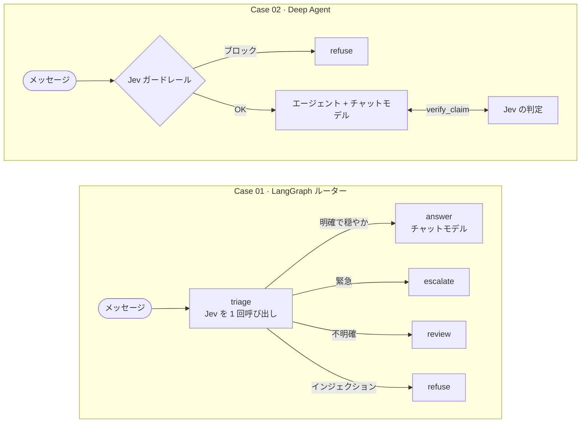

<div align="center">

# jyje/pilot-typesafeai-jev


🚀 TypeSafe AI の **Jev** を LangGraph と Deep Agents に組み込むパイロットプロジェクト（ChatGPT、NVIDIA NIM、LM Studio に対応）

[](https://github.com/jyje/pilot-typesafeai-jev)
[](LICENSE)
[](https://www.python.org)
[](https://docs.typesafe.ai/introduction/quickstart)
[](docs/02-inference-layer-ja.md)
[](https://build.nvidia.com)
[](https://lmstudio.ai)

[English](README.md) / [한국어](README-ko.md) / [日本語](README-ja.md) / [简体中文](README-zh-CN.md) / [Docs](docs/README.md)

---

**お役に立てたら、ぜひ ⭐ をお願いします。ほかの方が見つけやすくなります。**

</div>

## これは何か

[Jev](https://docs.typesafe.ai/concepts/system-one) はテキストを読み取り、生成したテキストではなく**確率付きの型付きの答え**を返します。ワークフローの制御はコードが握り、素早い判断は Jev が担当し、返信の文章は引き続きチャットモデルが書きます。

このリポジトリでは Jev を次の 2 か所に組み込み、その結果を記録しています。



チャットモデルは **ChatGPT サブスクリプション**（1）、**NVIDIA NIM**（2）、**LM Studio**（3）のいずれかで動作します。`LLM_PROVIDER` を設定するか、未設定のままにすると、設定済みのもののうち先頭のものが使われます。

## クイックスタート

```bash
cp .env.sample .env        # TYPESAFE_API_KEY を追加。NIM を使う場合は NVIDIA_API_KEY も追加
cd src && uv sync

uv run python doctor.py                    # キー、Jev、チャットモデルを確認
uv run python -m case01_routing.main       # サンプルメッセージで Case 01 を実行
uv run python -m case02_deepagents.main    # サンプルリクエストで Case 02 を実行
uv run pytest                              # オフラインテスト（キー不要）
```

## ドキュメント

| | |
| --- | --- |
| [Jev の概要](docs/01-jev-overview-ja.md) | Jev が何を返すか、どう問い合わせるか |
| [推論レイヤー](docs/02-inference-layer-ja.md) | ChatGPT、NVIDIA NIM、LM Studio を 1 つのファクトリーで切り替え |
| [ケース](docs/03-cases-ja.md) | 2 つのケースのグラフ図とシーケンス図 |
| [はじめに](docs/04-getting-started-ja.md) | セットアップ、環境変数、ノートブック、LangGraph Studio |
| [検証](docs/05-verification-ja.md) | テスト内容、結果、注意点 |

進捗とスコープは [PLAN.md](PLAN.md)、エージェント向けコンテキストは [AGENTS.md](AGENTS.md) をご覧ください。

## ライセンス

[MIT](LICENSE)
