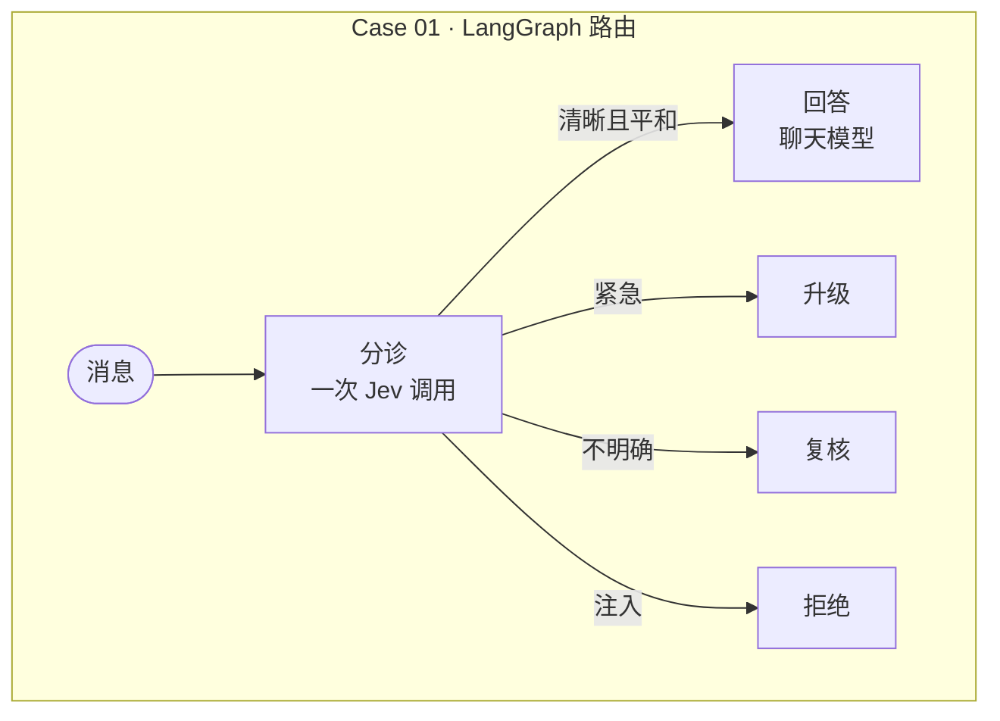
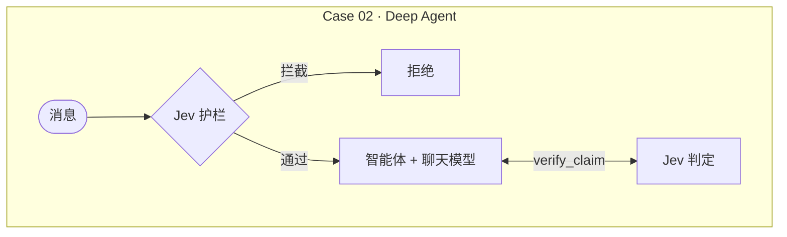

<div align="center">

# jyje/pilot-typesafeai-jev


🚀 在 LangGraph 和 Deep Agents 中试用 TypeSafe AI **Jev** 的试点项目，推理可选 ChatGPT、NVIDIA NIM 或 LM Studio

[](https://github.com/jyje/pilot-typesafeai-jev)
[](LICENSE)
[](https://www.python.org)
[](https://docs.typesafe.ai/introduction/quickstart)
[](docs/02-inference-layer-zh-CN.md)
[](https://build.nvidia.com)
[](https://lmstudio.ai)

[English](README.md) / [한국어](README-ko.md) / [日本語](README-ja.md) / [简体中文](README-zh-CN.md) / [Docs](docs/README.md)

---

**觉得有用？请点个 ⭐，帮助更多人发现这个项目。**

</div>

## 本试点的目标

把 TypeSafe AI 的 [Jev](https://docs.typesafe.ai/concepts/system-one) 真正接入 LangGraph 和 Deep Agents，
并记录哪些行得通、哪些行不通。

1. **理解 Jev。** 它返回带概率的类型化答案（`Choice`、`Score`、`Noul`），而不是生成的文本，每个答案都带有置信度。
   参见 [Jev 概览](docs/01-jev-overview-zh-CN.md)。
2. **说明各自分工。** 工作流由代码掌控，快速判断交给 Jev，回复仍由聊天模型来写。
3. **在 LangGraph 中用 Jev 做路由（Case 01）。** 一次请求提出三个问题，由代码选择路由，只有 `answer` 路由才消耗聊天模型的 token。
4. **在 Deep Agents 中用 Jev 做防护与核验（Case 02）。** 护栏中间件在智能体启动前筛查消息，
   `verify_claim` 工具返回带置信度的判定。参见[案例](docs/03-cases-zh-CN.md)。
5. **验证。** 用单元测试、实时脚本和已执行的 notebook 进行验证，并公开实测结果、失败情况与注意事项。
   参见[验证](docs/05-verification-zh-CN.md)。

它不是：

- Jev 准确率的基准测试。阈值只是未经调优的起点。
- 生产级代码。
- ChatGPT 订阅提供方的稳定集成，该提供方是实验性且非官方的。

## 两个案例

一览 Case 01 与 Case 02：





聊天模型可运行在你的 **ChatGPT 订阅**（1）、**NVIDIA NIM**（2）或 **LM Studio**（3）上。设置 `LLM_PROVIDER` 即可指定；不设置时，使用第一个已配置好的提供方。

## 快速开始

```bash
cp .env.sample .env        # 填入 TYPESAFE_API_KEY；使用 NIM 时还需填入 NVIDIA_API_KEY
cd src && uv sync

uv run python doctor.py                    # 检查密钥、Jev 和聊天模型
uv run python -m case01_routing.main       # 用示例消息运行 Case 01
uv run python -m case02_deepagents.main    # 用示例请求运行 Case 02
uv run pytest                              # 离线测试，无需密钥
```

## 文档

| 文档 | 内容 |
| --- | --- |
| [Jev 概览](docs/01-jev-overview-zh-CN.md) | 它返回什么，以及如何向它提问 |
| [推理层](docs/02-inference-layer-zh-CN.md) | 通过同一个工厂对接 ChatGPT、NVIDIA NIM 和 LM Studio |
| [用例](docs/03-cases-zh-CN.md) | 两个用例的流程图和时序图 |
| [快速上手](docs/04-getting-started-zh-CN.md) | 安装、环境变量、notebook、LangGraph Studio |
| [验证](docs/05-verification-zh-CN.md) | 测试了什么、结果和注意事项 |

进度与范围：[PLAN.md](PLAN.md)。智能体上下文：[AGENTS.md](AGENTS.md)。

## 许可证

[MIT](LICENSE)
