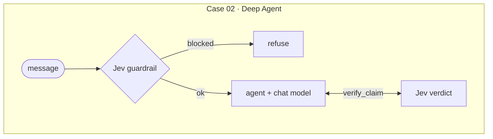

<div align="center">

# jyje/pilot-typesafeai-jev


🚀 Pilot project for TypeSafe AI **Jev** in LangGraph and Deep Agents, on ChatGPT, NVIDIA NIM, or LM Studio

[](https://github.com/jyje/pilot-typesafeai-jev)
[](LICENSE)
[](https://www.python.org)
[](https://docs.typesafe.ai/introduction/quickstart)
[](docs/02-inference-layer.md)
[](https://build.nvidia.com)
[](https://lmstudio.ai)

[English](README.md) / [한국어](README-ko.md) / [日本語](README-ja.md) / [简体中文](README-zh-CN.md) / [Docs](docs/README.md)

---

**Found this useful? Please give it a ⭐. It helps others find it.**

</div>

## A goal of this pilot

Put TypeSafe AI's [Jev](https://docs.typesafe.ai/concepts/system-one) into LangGraph and Deep Agents
for real, and record what works and what does not.

1. **Understand Jev.** It reads text and returns typed answers with probabilities (`Choice`, `Score`,
   `Noul`) instead of generated text, and every answer carries a confidence.
   See the [Jev overview](docs/01-jev-overview.md).
2. **Show who does what.** Code owns the workflow, Jev makes the fast judgment calls, and a chat model
   still writes the replies.
3. **Route with Jev in LangGraph (Case 01).** One request asks three questions, plain code picks the
   route, and only the `answer` route spends chat model tokens.
4. **Guard and verify with Jev in Deep Agents (Case 02).** A guardrail middleware screens the message
   before the agent starts, and a `verify_claim` tool returns a verdict with a confidence.
   See the [cases](docs/03-cases.md).
5. **Verify.** Unit tests, live scripts, and executed notebooks, with the measured results,
   failures, and caveats published. See the [verification](docs/05-verification.md).

What it is not:

- A benchmark of Jev's accuracy. The thresholds are untuned starting points.
- Production code.
- A stable ChatGPT subscription integration. That provider is experimental and unofficial.

## The two cases

Case 01 and Case 02 at a glance:




The chat model runs on your **ChatGPT subscription** (1), **NVIDIA NIM** (2), or **LM Studio** (3).
Set `LLM_PROVIDER`, or leave it unset to use the first one that is configured.

## Quick start

```bash
cp .env.sample .env        # add TYPESAFE_API_KEY, and NVIDIA_API_KEY for NIM
cd src && uv sync

uv run python doctor.py                    # check keys, Jev, and the chat model
uv run python -m case01_routing.main       # Case 01 on sample messages
uv run python -m case02_deepagents.main    # Case 02 on sample requests
uv run pytest                              # offline tests, no keys needed
```

## Docs

| Guide | What it covers |
| --- | --- |
| [Jev overview](docs/01-jev-overview.md) | what it returns and how to ask it |
| [Inference layer](docs/02-inference-layer.md) | ChatGPT, NVIDIA NIM, and LM Studio behind one factory |
| [Cases](docs/03-cases.md) | graph and sequence diagrams for both cases |
| [Getting started](docs/04-getting-started.md) | setup, environment, notebooks, LangGraph Studio |
| [Verification](docs/05-verification.md) | what was tested, results, and caveats |

Progress and scope: [PLAN.md](PLAN.md). Agent context: [AGENTS.md](AGENTS.md).

## License

[MIT](LICENSE)
