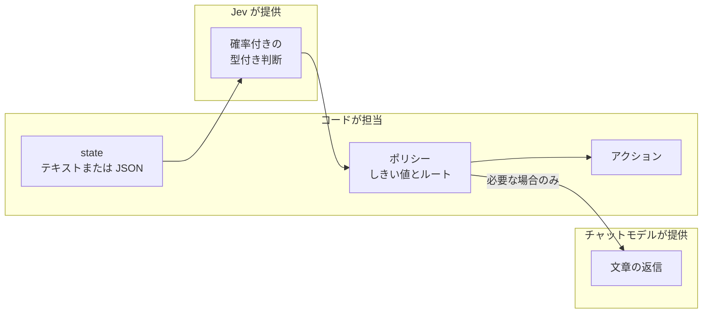
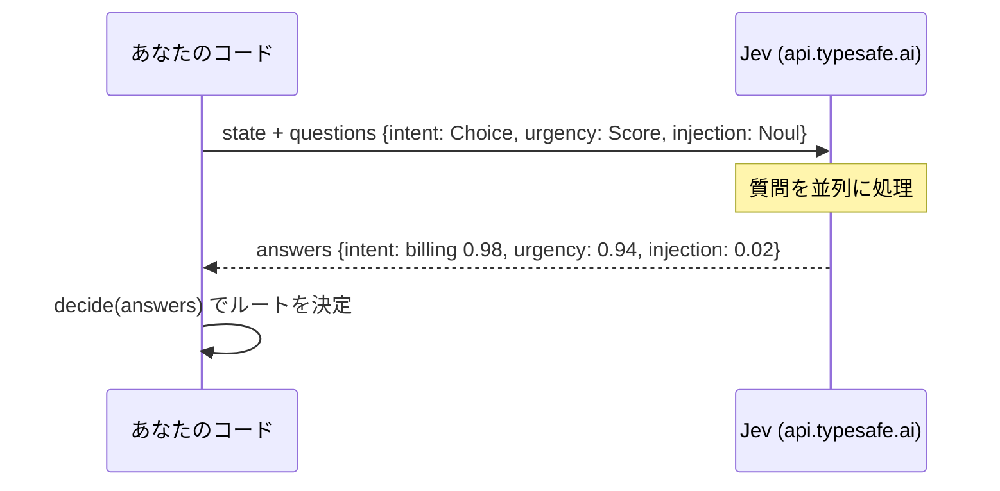

# Jev の概要

情報の正は https://docs.typesafe.ai の最新ドキュメントです（インデックスは `/llms.txt`、ページパスの末尾に `.md` を付けると Markdown で取得できます）。まずは
[クイックスタート](https://docs.typesafe.ai/introduction/quickstart)をご覧ください。

## Jev とは

Jev は TypeSafe AI のフラッグシップであり、最初の **System One** モデルです。**state**（テキスト、JSON オブジェクト、またはテキストの配列）を評価し、型付きの答えと確率を返します。返信の作成、コード生成、推論過程の説明は行わず、入力はテキストのみです。

出力が型付きなので、コード側で答えを検査したり組み合わせたりして、予測しやすいワークフローを組めます。各答えには確信度も付くため、コードが「自分で動くか」「人間や推論モデルにエスカレーションするか」を判断できます。



## 3 つのプリミティブ

| プリミティブ | 答え | 備考 |
| --- | --- | --- |
| `Choice` | 選ばれた選択肢、選択肢ごとの確率、確信度 | どれにも当てはまらない可能性がある場合は `other` のような該当なしの選択肢を含めます |
| `Score` | 順序付きレベル上の float、確率、確信度、凡例 | 各レベルは具体的な状況を記述し、それだけで意味が通じるようにします |
| `Noul` | yes の確率（確信度は別に持たない） | 0.5 付近は「中程度」ではなく「わからない」を意味します |

## 1 回のリクエストで複数の質問

同じ state に対する独立した質問は 1 回のリクエストにまとめます。質問は並列に実行され、互いの答えは見えません。



## SDK の使い方

```python
from typesafe_sdk import Choice, Noul, Score, TypeSafeClient

client = TypeSafeClient()          # TYPESAFE_API_KEY を読み込み、デフォルトは jev-latest

response = client.system_one(
    state="I've been trying to connect Stripe for 3 days. Please help ASAP.",
    questions={
        "department": Choice(
            instructions="Which team should handle this",
            criteria={"billing": "Payment issues", "technical": "Bugs or integrations"},
        ),
        "frustration": Score(
            instructions="How frustrated the customer appears",
            criteria=["Calm", "Frustrated but civil", "Very angry"],
        ),
        "is_urgent": Noul(instructions="The message conveys urgency"),
    },
)

response.answers["department"].choice       # "technical"
response.answers["frustration"].score       # 1.0
response.answers["is_urgent"].noul          # yes の確率
```

`AsyncTypeSafeClient` にも同じ `system_one` 呼び出しがあります。このリポジトリでは、どちらも `pilot_jev.jev.Jev`（`ask` と `aask`）の背後にまとめています。

## このリポジトリが従う設計ルール

- **独立した質問はまとめて問い合わせる。** 1 回のリクエストに複数の質問を入れます。
- **各質問に十分な state を渡す。** コンテキストが複数の要素からなる場合は、`verify_claim` が `claim` と `evidence` を使っているように、名前付きの JSON フィールドを優先します。
- **ポリシーはコード側に置く。** 重み付きのルールやしきい値は明示的に保持し、推論をやり直さなくても変更できるようにします。
- **確信度は答えの集中度を要約したもの。** 全体的な正しさを示すものではなく、実行してよい許可でもありません。
- **型付き出力が保証するのはインターフェースであり、真実ではない。** 自分のデータで検証してください。
- **API キーは** Web アプリでは**サーバー側に置く。**

## テストで得られた実務上のメモ

- Score の答えはレベルの間の float で返ってきます（例: 「後回しでよい」と「近いうちに対応が必要」の間の 0.94）。そのため `urgent_at = 1.5` のようなしきい値を連続値に対して使えます。
- SDK のレスポンスのフィクスチャは `model_validate` ではなく `model_validate_json` で作成してください。score-level のキーはモデル内では整数ですが、JSON では文字列になります。
