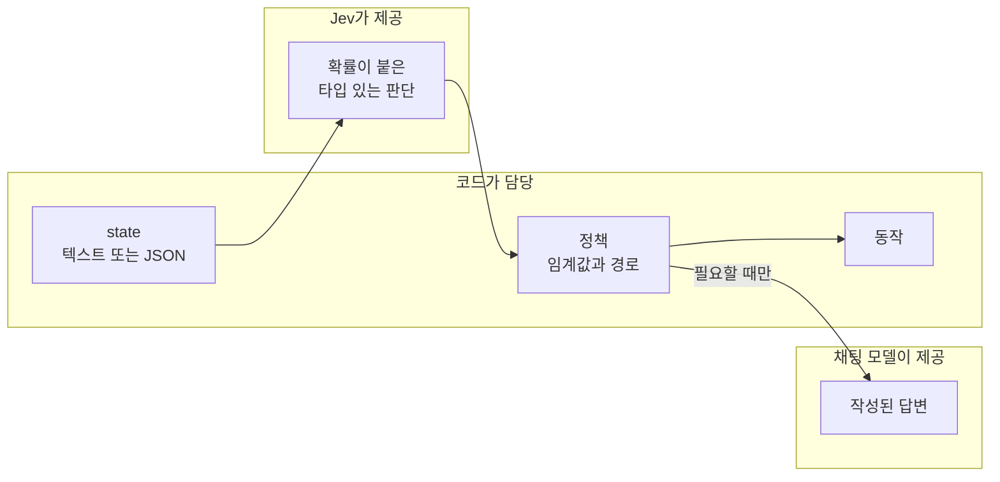
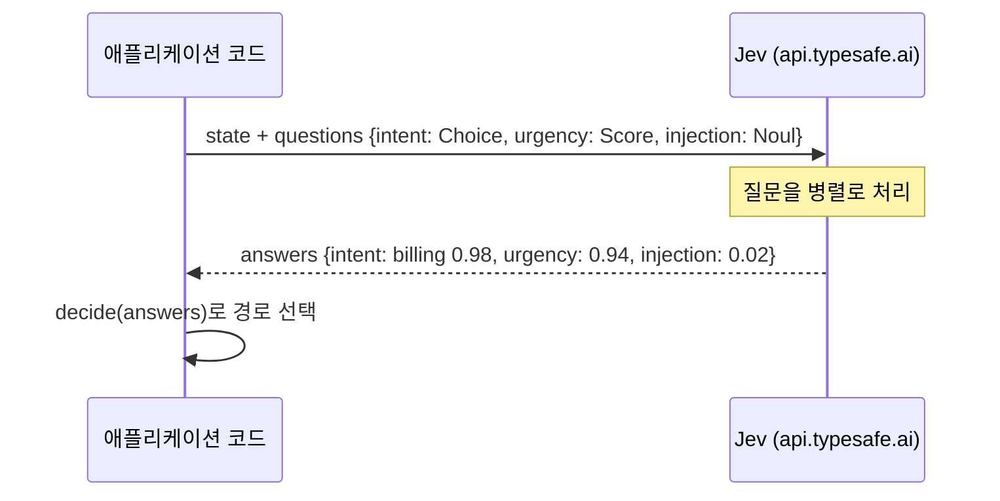

# Jev 개요

기준 문서: https://docs.typesafe.ai 의 최신 문서입니다(색인은 `/llms.txt`, 페이지 경로 뒤에 `.md`를 붙이면 Markdown으로 볼 수 있습니다).
먼저 [퀵스타트](https://docs.typesafe.ai/introduction/quickstart)를 읽어 보세요.

## Jev란

Jev는 TypeSafe AI의 대표 모델이자 첫 번째 **System One** 모델입니다. **state**(텍스트, JSON 객체, 텍스트 배열)를 평가해 타입이 있는 답과 확률을 돌려줍니다. 답변을 작성하거나 코드를 생성하거나 추론 과정을 설명하지 않으며, 입력은 텍스트만 받습니다.

출력에 타입이 있으므로 코드가 답을 검사하고 조합해 예측 가능한 워크플로를 만들 수 있습니다. 각 답에는 신뢰도도 함께 붙기 때문에, 코드가 직접 처리할 때와 사람이나 추론 모델에 넘길 때를 판단할 수 있습니다.



## 세 가지 기본 요소

| 기본 요소 | 답 | 비고 |
| --- | --- | --- |
| `Choice` | 선택된 옵션, 옵션별 확률, 신뢰도 | 어느 것에도 맞지 않을 수 있다면 `other` 같은 해당 없음 옵션을 포함하세요 |
| `Score` | 순서가 있는 단계 위의 실수 값, 확률, 신뢰도, 범례 | 각 단계는 구체적인 상황을 설명해야 하며 그 자체로 이해되어야 합니다 |
| `Noul` | 예일 확률, 별도의 신뢰도 없음 | 0.5 근처의 값은 "보통"이 아니라 "확신할 수 없음"을 뜻합니다 |

## 한 번의 요청, 여러 질문

같은 state에 대한 독립적인 질문은 한 번의 요청에 담습니다. 질문들은 병렬로 실행되며 서로의 답을 볼 수 없습니다.



## SDK 사용법

```python
from typesafe_sdk import Choice, Noul, Score, TypeSafeClient

client = TypeSafeClient()          # reads TYPESAFE_API_KEY, defaults to jev-latest

response = client.system_one(
    state="I've been trying to connect Stripe for 3 days. Please help ASAP.",
    questions={
        "department": Choice(
            instructions="Which team should handle this",
            criteria={"billing": "Payment issues", "technical": "Bugs or integrations"},
        ),
        "frustration": Score(
            instructions="How frustrated the customer appears",
            criteria=["Calm", "Frustrated but civil", "Very angry"],
        ),
        "is_urgent": Noul(instructions="The message conveys urgency"),
    },
)

response.answers["department"].choice       # "technical"
response.answers["frustration"].score       # 1.0
response.answers["is_urgent"].noul          # probability of yes
```

`AsyncTypeSafeClient`도 같은 `system_one` 호출을 제공합니다. 이 저장소에서는 둘 다 `pilot_jev.jev.Jev`(`ask`와 `aask`) 뒤에 있습니다.

## 이 저장소가 따르는 설계 규칙

- **독립적인 질문은 함께 묻습니다.** 한 번의 요청에 여러 질문을 담습니다.
- **각 질문에 충분한 state를 줍니다.** 맥락이 여러 부분으로 이뤄지면 `verify_claim`이 `claim`과 `evidence`를 쓰는 것처럼 이름 붙인 JSON 필드를 권장합니다.
- **정책은 코드에 둡니다.** 가중치 규칙과 임계값을 명시적으로 두면 추론을 다시 실행하지 않고도 바꿀 수 있습니다.
- **신뢰도는 확률 분포의 집중도를 요약한 값입니다.** 전체적인 정확성을 뜻하지 않으며, 동작해도 된다는 허가도 아닙니다.
- **타입 있는 출력이 보장하는 것은 인터페이스이지 진실이 아닙니다.** 자체 데이터로 검증하세요.
- 웹 앱에서는 **API 키를 서버 쪽에만** 두세요.

## 테스트에서 얻은 실무 메모

- Score 답은 단계 사이의 실수 값으로 돌아옵니다(예: "can wait"와 "needs attention soon" 사이의 0.94). 따라서 `urgent_at = 1.5` 같은 임계값을 연속값에 적용할 수 있습니다.
- SDK 응답 픽스처는 `model_validate`가 아니라 `model_validate_json`으로 만드세요. Score 단계 키는 모델에서는 정수이지만 JSON에서는 문자열입니다.
