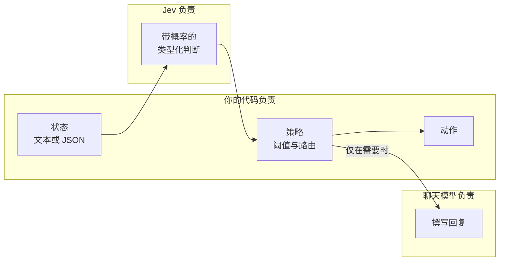
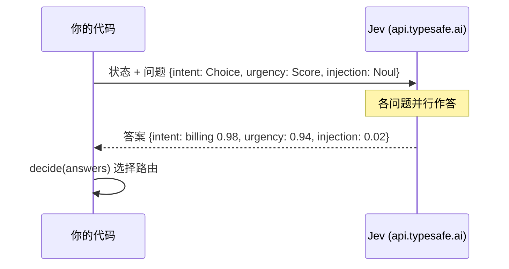

# Jev 概览

权威来源：TypeSafe AI 的在线文档 <https://docs.typesafe.ai>（索引：`/llms.txt`，在页面路径后追加 `.md` 即可获取 Markdown）。建议从[快速入门](https://docs.typesafe.ai/introduction/quickstart)开始。

## Jev 是什么

Jev 是 TypeSafe AI 的旗舰模型，也是首个 **System One** 模型。它对一个**状态**（文本、JSON 对象或文本数组）进行评估，返回类型化的答案和概率。它不会撰写回复、生成代码，也不会解释自己的推理过程，并且只接受文本输入。

由于输出是类型化的，代码可以检查这些答案，并将它们组合成可预测的工作流。每个答案还附带置信度，代码据此决定何时直接执行，何时升级交给人工或推理模型处理。



## 三种基本类型

| 类型 | 答案 | 说明 |
| --- | --- | --- |
| `Choice` | 选中的选项、各选项的概率、置信度 | 当可能没有合适选项时，请加入 `other` 这类“都不匹配”的选项 |
| `Score` | 有序等级上的一个浮点数、各等级概率、置信度、图例 | 每个等级都要描述一个具体情境，且能独立成立 |
| `Noul` | “是”的概率，没有单独的置信度 | 接近 0.5 的值表示“不确定”，而不是“中等” |

## 一次请求，多个问题

针对同一状态的相互独立的问题，放在同一次请求中。它们并行执行，彼此看不到对方的答案。



## SDK 用法

```python
from typesafe_sdk import Choice, Noul, Score, TypeSafeClient

client = TypeSafeClient()          # reads TYPESAFE_API_KEY, defaults to jev-latest

response = client.system_one(
    state="I've been trying to connect Stripe for 3 days. Please help ASAP.",
    questions={
        "department": Choice(
            instructions="Which team should handle this",
            criteria={"billing": "Payment issues", "technical": "Bugs or integrations"},
        ),
        "frustration": Score(
            instructions="How frustrated the customer appears",
            criteria=["Calm", "Frustrated but civil", "Very angry"],
        ),
        "is_urgent": Noul(instructions="The message conveys urgency"),
    },
)

response.answers["department"].choice       # "technical"
response.answers["frustration"].score       # 1.0
response.answers["is_urgent"].noul          # probability of yes
```

`AsyncTypeSafeClient` 提供同样的 `system_one` 调用。在本仓库中，两者都封装在 `pilot_jev.jev.Jev` 之后（`ask` 和 `aask`）。

## 本仓库遵循的设计规则

- **把相互独立的问题放在一起问。** 一次请求，多个问题。
- **给每个问题足够的状态。** 当上下文包含多个部分时，优先使用带名字的 JSON 字段，就像 `verify_claim` 用 `claim` 和 `evidence` 那样。
- **策略留在代码里。** 加权规则和阈值保持显式，可以随时调整，无需重新运行推理。
- **置信度反映的是概率的集中程度。** 它不代表整体正确性，也不代表可以放心执行。
- **类型化输出保证的是接口，而不是真相。** 请在你自己的数据上做验证。
- **在 Web 应用中，API 密钥只放在服务端。**

## 测试中的实用经验

- Score 的答案是介于各等级之间的浮点数（例如 0.94，介于“可以等一等”和“需要尽快处理”之间），因此像 `urgent_at = 1.5` 这样的阈值是作用在连续值上的。
- 构建 SDK 响应 fixture 时，请使用 `model_validate_json`，而不是 `model_validate`：score 等级的键在模型中是整数，在 JSON 中却是字符串。
