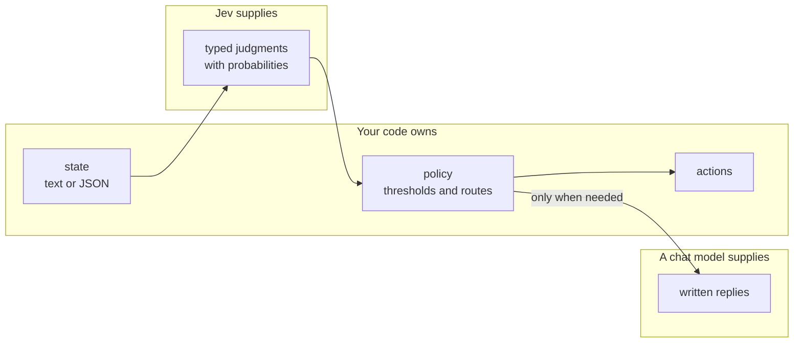
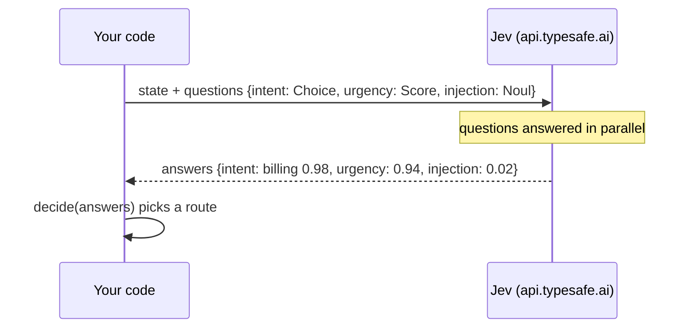

# Jev overview

Source of truth: the live docs at https://docs.typesafe.ai (index: `/llms.txt`, append `.md` to a
page path for Markdown). Start with the
[quickstart](https://docs.typesafe.ai/introduction/quickstart).

## What Jev is

Jev is TypeSafe AI's flagship and first **System One** model. It evaluates a **state** (text, a
JSON object, or an array of text) and returns typed answers and probabilities. It does not write
replies, produce code, or explain its reasoning, and it accepts text only.

Because the output is typed, code can inspect and combine answers into predictable workflows. Each
answer also carries a confidence, so code can decide when to act and when to escalate to a person
or a reasoning model.



## The three primitives

| Primitive | Answer | Notes |
| --- | --- | --- |
| `Choice` | selected option, per-option probabilities, confidence | Include a no-match option such as `other` when nothing may fit |
| `Score` | a float on ordered levels, probabilities, confidence, legend | Each level must describe a concrete situation and stand on its own |
| `Noul` | probability of yes, no separate confidence | A value near 0.5 means "unsure", not "medium" |

## One request, many questions

Independent questions over the same state go in one request. They run in parallel and cannot see
each other's answers.



## SDK usage

```python
from typesafe_sdk import Choice, Noul, Score, TypeSafeClient

client = TypeSafeClient()          # reads TYPESAFE_API_KEY, defaults to jev-latest

response = client.system_one(
    state="I've been trying to connect Stripe for 3 days. Please help ASAP.",
    questions={
        "department": Choice(
            instructions="Which team should handle this",
            criteria={"billing": "Payment issues", "technical": "Bugs or integrations"},
        ),
        "frustration": Score(
            instructions="How frustrated the customer appears",
            criteria=["Calm", "Frustrated but civil", "Very angry"],
        ),
        "is_urgent": Noul(instructions="The message conveys urgency"),
    },
)

response.answers["department"].choice       # "technical"
response.answers["frustration"].score       # 1.0
response.answers["is_urgent"].noul          # probability of yes
```

`AsyncTypeSafeClient` has the same `system_one` call. In this repo both live behind
`pilot_jev.jev.Jev` (`ask` and `aask`).

## Design rules this repo follows

- **Ask independent questions together.** One request, many questions.
- **Give each question enough state.** Prefer named JSON fields when the context has several parts,
  as `verify_claim` does with `claim` and `evidence`.
- **Keep policy in code.** Weighted rules and thresholds stay explicit and can change without
  rerunning inference.
- **Confidence summarizes concentration.** It is not overall correctness and not permission to act.
- **Typed output guarantees the interface, not truth.** Validate on your own data.
- **Keep API keys server-side** in web apps.

## Practical notes from testing

- Score answers come back as a float between levels (for example 0.94 between "can wait" and
  "needs attention soon"), so thresholds such as `urgent_at = 1.5` work on a continuous value.
- Build SDK response fixtures with `model_validate_json`, not `model_validate`: score-level keys are
  integers in the model but strings in JSON.
