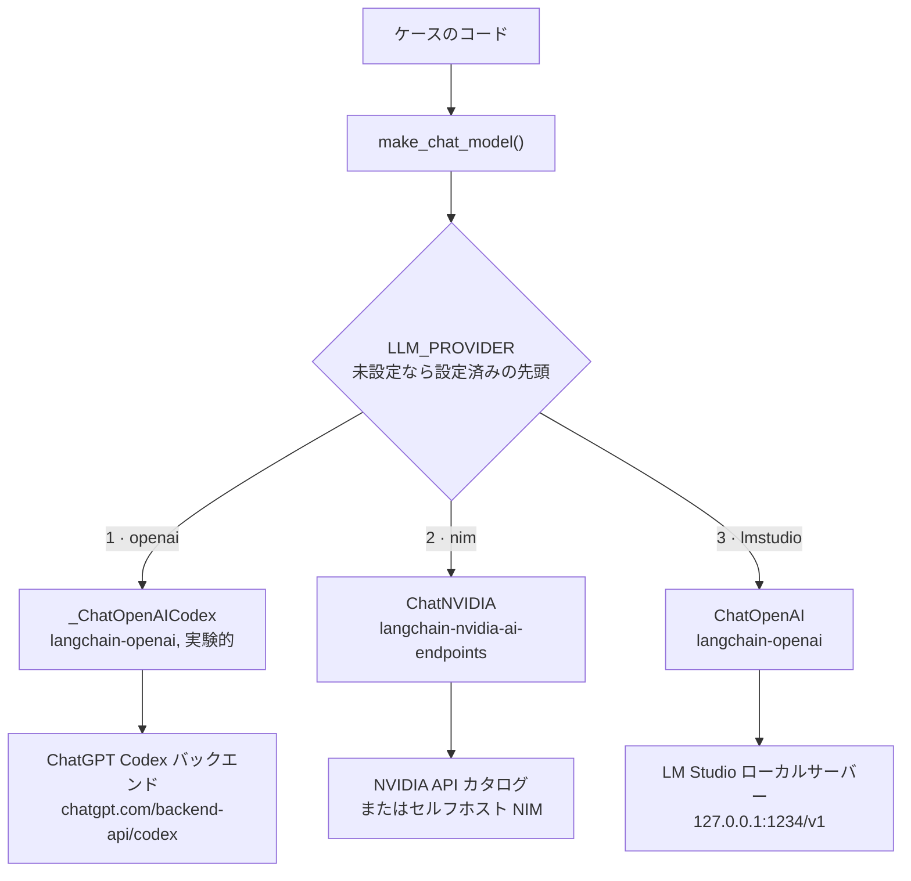
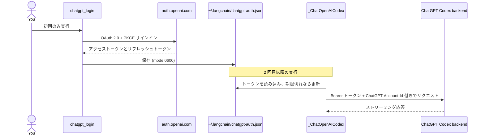

# 推論レイヤー

Jev が返すのは型付きの判断なので、返信は引き続きチャットモデルが担います。`pilot_jev.llm.make_chat_model`
が環境変数からチャットモデルを構築するため、各ケースのコードには provider の名前が一切登場しません。

provider は 3 種類あり、優先順位は次のとおりです。

| # | `LLM_PROVIDER` | バックエンド | 認証 |
| --- | --- | --- | --- |
| 1 | `openai` | Codex バックエンド経由の ChatGPT サブスクリプション | ChatGPT OAuth サインイン（API キー不要） |
| 2 | `nim` | NVIDIA NIM | `NVIDIA_API_KEY` |
| 3 | `lmstudio` | LM Studio ローカルサーバー | なし |



`LLM_PROVIDER` が未設定の場合は、設定済みの provider のうち先頭のものが選ばれます。ChatGPT にサインイン済みなら `openai`、そうでなく `NVIDIA_API_KEY` または `NVIDIA_BASE_URL` が設定されていれば `nim`、それ以外は `lmstudio` です。`LLM_PROVIDER` を設定した場合は常にそちらが優先されます。 `.env.sample` のプレースホルダーは設定済みとは見なされません。自動選択は ChatGPT プランの利用上限に達したことを知り得ないので、達した場合は `LLM_PROVIDER` を自分で指定してください。

| 変数 | デフォルト | 意味 |
| --- | --- | --- |
| `LLM_PROVIDER` | 設定済みの先頭 | `openai`、`nim`、`lmstudio` のいずれか |
| `LLM_MODEL` | provider ごと | モデル ID |
| `LLM_TIMEOUT` | `180` | 1 リクエストあたりの秒数 |
| `LLM_ENABLE_THINKING` | 未設定 | `false` にすると NIM の推論モデルで thinking をオフにします |

## 1. OpenAI サブスクリプション（ChatGPT Codex OAuth）

OpenAI の API キーの代わりに、ChatGPT のサブスクリプションを使います。公開の `api.openai.com` API では**ありません**。`langchain-openai` に含まれる実験的な `_ChatOpenAICodex` が ChatGPT OAuth（PKCE）でサインインし、ChatGPT Codex バックエンドを呼び出します。Hermes Agent の `openai-codex` provider と同じ考え方です。OAuth トークンを `ChatOpenAI` に渡しても動作しません。

```bash
uv run python -m pilot_jev.chatgpt_login   # ブラウザを開き、最大 15 分間待機する
```

サインインではコールバックを `http://localhost:1455` で待ち受けるため、同じマシン上のブラウザが必要です。`chatgpt_login --device`（ヘッドレスマシン向けのデバイスコード方式）も用意されていますが、現時点では失敗します。`langchain-openai` 1.6.2 では、ライブラリがフォームエンコードの本文を送信するのに対し、エンドポイントが JSON を要求するようになったため、OpenAI が HTTP 400 を返します。

モデル名はアカウントやプランによって異なります。お使いのアカウントで利用できるモデルを一覧表示し、`LLM_MODEL` に設定してください。

```bash
uv run python -m pilot_jev.chatgpt_models   # モデル ID だけを表示し、トークンは表示しない
```

```dotenv
LLM_PROVIDER=openai
LLM_MODEL=...              # default gpt-5.5, from the langchain-openai docs
```

一覧に表示された名前でも失敗することがあります。ChatGPT アカウントでは拒否されるモデルがあり（HTTP 400）、モデルによっては利用上限に達していることもあります（HTTP 429）。



注意点は次のとおりです。

- **実験的で非公式。** クラスは private（`_ChatOpenAICodex`）であり、変更される可能性があります。お使いの OpenAI アカウント、プラン、および適用される OpenAI の規約が ChatGPT 認証による Codex アクセスを許可している場合にのみ使用してください。その判断はご自身の責任となります。共有環境や本番環境では、API キー、Azure OpenAI、または社内ゲートウェイの利用をおすすめします。
- トークンは `~/.codex/auth.json` では**なく**、`~/.langchain/chatgpt-auth.json` に保存されます。別のプログラムから Codex CLI のトークンを更新すると Codex CLI のセッションが壊れることがあるため、このリポジトリはそのファイルには一切触れません。
- バックエンドはストリーミングのみに対応しています。それでも `invoke` は集約された 1 つのメッセージを返します。
- 呼び出しは ChatGPT プランの利用上限に加算されます。

## 2. NVIDIA NIM

パッケージは `langchain-nvidia-ai-endpoints`、クラスは `ChatNVIDIA` です。`langchain-nvidia-nim` というパッケージは存在しません。

```dotenv
LLM_PROVIDER=nim
NVIDIA_API_KEY=nvapi-...
# LLM_MODEL=nvidia/nemotron-3.5-lightning-30b-a3b   (default)
# NVIDIA_BASE_URL=http://0.0.0.0:8000/v1            (self-hosted NIM)
```

キーは https://build.nvidia.com で取得できます。`ChatNVIDIA` 経由で 2 つのモデルをテストし、それぞれ通常の質問への回答とツール呼び出しの出力を確認しました。

| モデル | チャット | ツール呼び出し |
| --- | --- | --- |
| `nvidia/nemotron-3.5-lightning-30b-a3b`（デフォルト） | yes | yes |
| `z-ai/glm-5.3-flash` | yes | yes |

注意点は次のとおりです。

- **レイテンシは大きく、ばらつきもあります。** ホスト型の単発呼び出しでおよそ 6〜160 秒かかったため、`LLM_TIMEOUT` のデフォルトは 180 秒にしています。クライアントのデフォルトである 60 秒では `doctor.py` が失敗しました。
- **カタログに載っていても動作するとは限りません。** `meta/llama-3.3-70b-instruct` を含む複数の掲載モデルが、提供終了のため `410 Gone` を返しました。使う前に一度呼び出して確認してください。
- **推論モデル**は thinking に時間を使うことがあり、`nvidia/nemotron-3.5-lightning-30b-a3b` では thinking の内容が返信に混ざることがありました。`LLM_ENABLE_THINKING=false` を設定すると `chat_template_kwargs.enable_thinking: false` が送信されます。
- **接続がリセットされることがあります。** `ChatNVIDIA` にはリトライの設定がないため、`pilot_jev.retry.with_retries` が、接続エラー、タイムアウト、HTTP 429 または 5xx の場合にチャットモデルの呼び出しをリトライします（401、403、404 ではリトライしません）。対象は Case 01 の `answer` ノードとエージェントのミドルウェアの中のその呼び出しだけで、グラフ全体の実行は包みません。再実行すると Jev をもう一度呼び出して課金されてしまうためです。Jev のエラーはここではリトライしません。TypeSafe SDK がすでにリトライしています。
- 計測した挙動と未解決の問題は [05-verification-ja.md](05-verification-ja.md) にまとめています。

### キーを macOS キーチェーンに保存する

```bash
security add-generic-password -a pilot-typesafeai-jev -s "NVIDIA API Key" -w    # 値の入力を求められます
NVIDIA_API_KEY="$(security find-generic-password -s 'NVIDIA API Key' -a pilot-typesafeai-jev -w)" \
  uv run python doctor.py
```

## 3. LM Studio

LM Studio は OpenAI 互換の API を提供するため、`ChatOpenAI` にカスタムの `base_url` を指定して接続します。

```dotenv
LLM_PROVIDER=lmstudio
LLM_MODEL=google/gemma-4-e4b
# LMSTUDIO_BASE_URL=http://127.0.0.1:1234/v1
```

1. https://lmstudio.ai から LM Studio をインストールし、ツール呼び出しに対応したモデルをダウンロードします。
2. ローカルサーバーを起動します。**Developer**、**Local Server** の順に開いてステータスを **Running** にするか、`lms server start` を実行します。
3. モデルを **コンテキスト長 16384 以上**でロードします（ここでは 32768 を使用しました）。
   `lms load google/gemma-4-e4b --context-length 32768`
4. `uv run python doctor.py` を実行します。サーバーが応答することと、モデルが一覧にあることを確認します。

Deep Agents はシステムプロンプトを約 5,800 トークン追加するため、デフォルトのコンテキスト長 4096 では最初の返信の前に失敗します。LM Studio は API キーを検証しないので、コードは `lm-studio` を送信します。

## リトライ

`pilot_jev.retry.with_retries` が、3 つのバックエンドすべてに対する唯一のリトライの担い手です。論理的なチャットモデル
呼び出し 1 回につき、最大 3 回試します（最初の呼び出しと再試行 2 回）。ChatGPT と LM Studio のモデルは
`max_retries=0` で作られ、`ChatNVIDIA` にはリトライ設定がないため、ベンダー SDK が独自の試行を上乗せすることは
ありません。ベンダー側のリトライを再び有効にすると、2 つの層が掛け算になります。

- **再試行の対象:** 接続エラー、タイムアウト、NIM の HTTP 429、500、502、503、504。OpenAI クライアントのエラー
  （ChatGPT と LM Studio）には、以前の SDK の方針をそのまま使います。HTTP 408、409、429 とすべての 5xx で、
  `x-should-retry` ヘッダがあればそれが優先されます。ステータスがなく、サーバーが過負荷だと伝えるストリームのエラーイベントも再試行します。400、401、403、404 は再試行せず、プランやクォータを使い切った
  ことを示す 429（`usage_limit_reached`、`insufficient_quota`）も、待っても直らないので再試行しません。Jev のエラーは
  TypeSafe SDK 自身が再試行するため、ここでは再試行しません。
- **待ち時間:** ジッタ付きの指数バックオフ（ジッタ前で 5 秒、10 秒）で、上限は 60 秒です。エラーに `Retry-After`
  ヘッダ（秒または HTTP 日付）があれば、その値が待ち時間になり、こちらにも上限があります。
- **観測方法:** 再試行のたびに、任意の `on_retry(attempt, error)` コールバックと `pilot_jev.retry` ロガーに、エラーの
  種類と HTTP ステータスが記録されます。エラーメッセージは記録しません。
- **適用箇所:** Case 01 の `answer` ノード、Case 02 の `RetryModelCalls` ミドルウェア、`doctor.py` の実サービス
  チェックです。グラフやエージェントの実行全体には使いません。再実行すると Jev をもう一度呼んでしまうためです。

## 選び方

| | OpenAI サブスクリプション | NVIDIA NIM（ホスト型） | LM Studio |
| --- | --- | --- | --- |
| キー | ChatGPT サインイン | `NVIDIA_API_KEY` | なし |
| コスト | ChatGPT プランの利用上限 | トークン従量、プランによる | 無料（自分のハードウェアを使用） |
| 速度 | [05-verification-ja.md](05-verification-ja.md) を参照 | テストでは 1 回あたり 6〜160 秒 | ハードウェアとモデルによる |
| ネットワーク | 必要 | 必要 | チャットモデルには不要 |
| ステータス | 実験的、非公式 | 安定したクライアント | 安定したクライアント |

どの構成でも Jev はホスト型 API なので、`TYPESAFE_API_KEY` とネットワーク接続は常に必要です。
