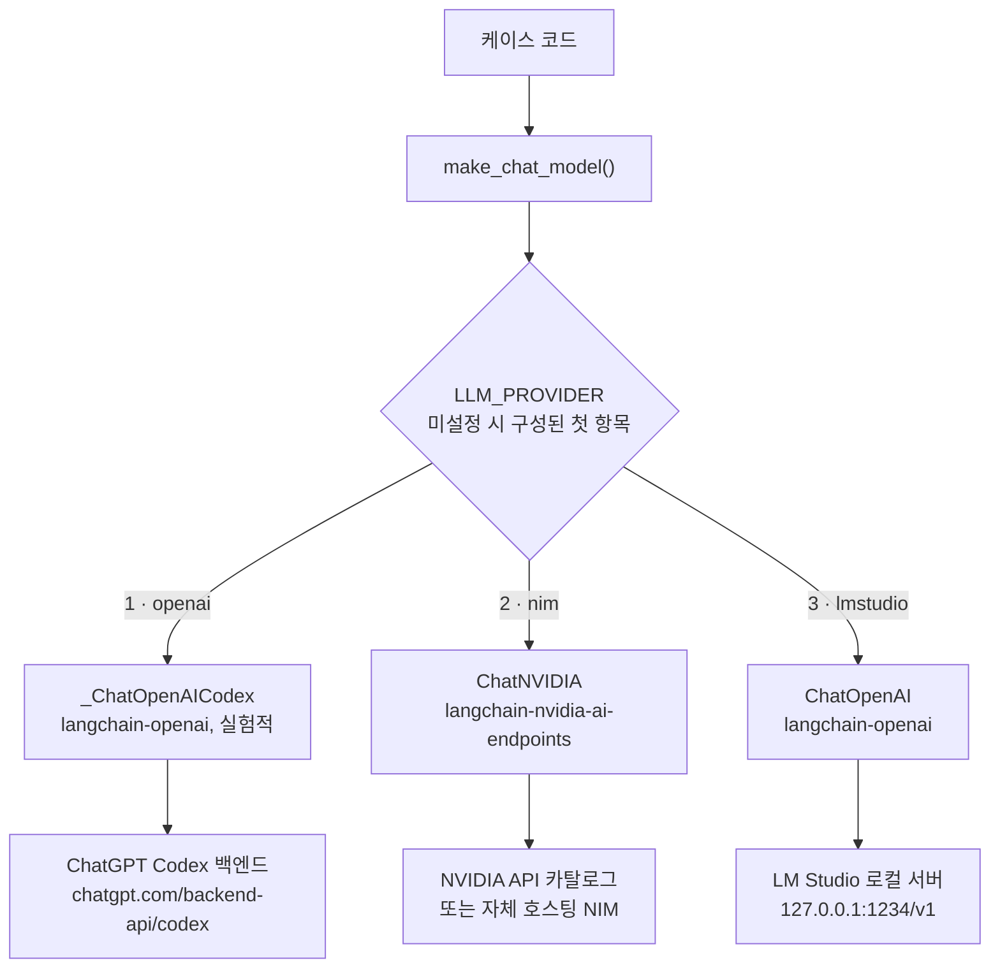
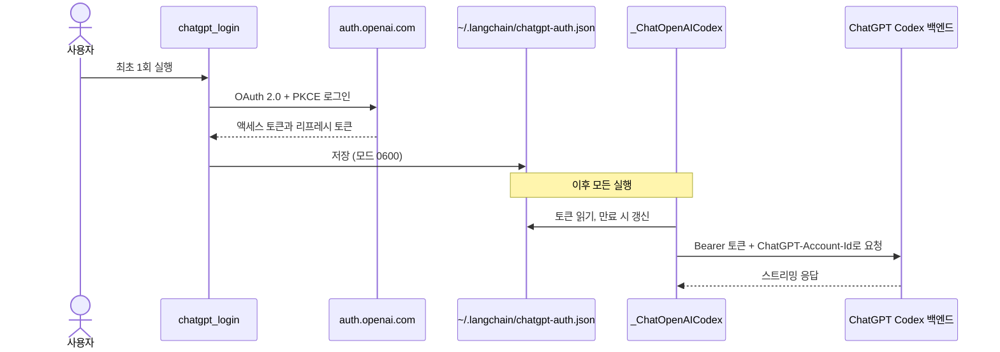

# 추론 계층

Jev는 타입이 있는 판단을 돌려주므로 답변은 여전히 채팅 모델이 작성합니다. `pilot_jev.llm.make_chat_model`이 환경 변수로 채팅 모델을 만들기 때문에, 케이스 코드에는 프로바이더가 등장하지 않습니다.

프로바이더는 세 가지이며 우선순위 순서입니다.

| # | `LLM_PROVIDER` | 백엔드 | 인증 |
| --- | --- | --- | --- |
| 1 | `openai` | Codex 백엔드를 통한 ChatGPT 구독 | ChatGPT OAuth 로그인, API 키 불필요 |
| 2 | `nim` | NVIDIA NIM | `NVIDIA_API_KEY` |
| 3 | `lmstudio` | LM Studio 로컬 서버 | 없음 |



`LLM_PROVIDER`를 설정하지 않으면 구성된 프로바이더 중 가장 먼저 해당하는 것이 선택됩니다. ChatGPT에 로그인했다면 `openai`, 그렇지 않고 `NVIDIA_API_KEY` 또는 `NVIDIA_BASE_URL`이 설정되어 있으면 `nim`, 둘 다 아니면 `lmstudio`입니다. `LLM_PROVIDER`를 설정하면 항상 그 값이 우선합니다.

| 변수 | 기본값 | 의미 |
| --- | --- | --- |
| `LLM_PROVIDER` | 구성된 첫 항목 | `openai`, `nim`, `lmstudio` 중 하나 |
| `LLM_MODEL` | 프로바이더별 | 모델 ID |
| `LLM_TIMEOUT` | `180` | 요청당 제한 시간(초) |
| `LLM_ENABLE_THINKING` | 미설정 | `false`이면 NIM 추론 모델의 thinking을 끕니다 |

## 1. OpenAI 구독 (ChatGPT Codex OAuth)

OpenAI API 키 대신 ChatGPT 구독을 사용합니다. 공개 `api.openai.com` API가 **아닙니다**. `langchain-openai`에 포함된 실험적 클래스 `_ChatOpenAICodex`가 ChatGPT OAuth(PKCE)로 로그인해 ChatGPT Codex 백엔드를 호출하는 방식이며, Hermes Agent가 `openai-codex` 프로바이더에 쓰는 방식과 같은 발상입니다. OAuth 토큰을 `ChatOpenAI`에 넘기는 방식은 동작하지 않습니다.

```bash
uv run python -m pilot_jev.chatgpt_login   # 브라우저를 열고 최대 15분간 대기합니다
```

로그인은 콜백을 받기 위해 `http://localhost:1455`에서 대기하므로 같은 머신에 브라우저가 있어야 합니다. `chatgpt_login --device`(device code 방식, 브라우저 없는 머신용)도 있지만 현재는 실패합니다. `langchain-openai` 1.6.2에서는 라이브러리가 form 인코딩 본문을 보내는데 엔드포인트는 이제 JSON을 요구하기 때문에 OpenAI가 HTTP 400으로 응답합니다.

모델 이름은 계정과 요금제마다 다릅니다. 내 계정이 제공하는 모델을 조회한 뒤 `LLM_MODEL`을 설정하세요.

```bash
uv run python -m pilot_jev.chatgpt_models   # 모델 ID만 출력하며 토큰은 출력하지 않습니다
```

```dotenv
LLM_PROVIDER=openai
LLM_MODEL=...              # default gpt-5.5, from the langchain-openai docs
```

목록에 있는 이름도 실패할 수 있습니다. ChatGPT 계정에서는 거부되는 모델이 있고(HTTP 400), 모델이 사용량 한도를 초과했을 수도 있습니다(HTTP 429).



알아 둘 점은 다음과 같습니다.

- **실험적이며 비공식입니다.** 클래스가 비공개(`_ChatOpenAICodex`)이므로 바뀔 수 있습니다. OpenAI 계정, 요금제, 관련 OpenAI 약관이 ChatGPT 인증 기반 Codex 접근을 허용하는 환경에서만 사용하세요. 이에 대한 책임은 사용자에게 있습니다. 공유 환경이나 프로덕션에서는 API 키, Azure OpenAI, 사내 게이트웨이를 권장합니다.
- 토큰은 `~/.codex/auth.json`이 **아니라** `~/.langchain/chatgpt-auth.json`에 저장됩니다. 다른 프로그램에서 Codex CLI 토큰을 갱신하면 Codex CLI 세션이 깨질 수 있으므로, 이 저장소는 해당 파일을 건드리지 않습니다.
- 백엔드는 스트리밍만 지원합니다. 그래도 `invoke`는 하나로 합쳐진 메시지를 반환합니다.
- 호출은 ChatGPT 요금제의 사용량 한도에 포함됩니다.

## 2. NVIDIA NIM

패키지는 `langchain-nvidia-ai-endpoints`, 클래스는 `ChatNVIDIA`입니다. `langchain-nvidia-nim`이라는 패키지는 없습니다.

```dotenv
LLM_PROVIDER=nim
NVIDIA_API_KEY=nvapi-...
# LLM_MODEL=nvidia/nemotron-3.5-lightning-30b-a3b   (default)
# NVIDIA_BASE_URL=http://0.0.0.0:8000/v1            (self-hosted NIM)
```

키는 https://build.nvidia.com 에서 발급받습니다. `ChatNVIDIA`로 두 모델을 테스트했으며, 각각 일반 질문에 답하고 도구 호출을 생성하는지 확인했습니다.

| 모델 | 채팅 | 도구 호출 |
| --- | --- | --- |
| `nvidia/nemotron-3.5-lightning-30b-a3b` (기본값) | 예 | 예 |
| `z-ai/glm-5.3-flash` | 예 | 예 |

알아 둘 점은 다음과 같습니다.

- **지연 시간이 길고 편차가 큽니다.** 호스팅 호출 한 건에 대략 6초에서 160초가 걸렸기 때문에 `LLM_TIMEOUT` 기본값을 180초로 잡았습니다. 클라이언트 기본값인 60초에서는 `doctor.py`가 실패했습니다.
- **카탈로그에 나온다고 모델이 동작하는 것은 아닙니다.** `meta/llama-3.3-70b-instruct`를 포함해 목록에 있던 여러 모델이 지원 종료로 `410 Gone`을 반환했습니다. 사용하기 전에 모델을 직접 호출해 보세요.
- **추론 모델**은 thinking에 시간을 쓸 수 있으며, `nvidia/nemotron-3.5-lightning-30b-a3b`는 thinking 내용을 응답에 섞어 내보내는 경우가 있었습니다. `LLM_ENABLE_THINKING=false`를 설정하면 `chat_template_kwargs.enable_thinking: false`를 전송합니다.
- **연결이 끊길 수 있습니다.** `ChatNVIDIA`에는 재시도 설정이 없으므로 `pilot_jev.retry.with_retries`가 연결 오류, 타임아웃, HTTP 429 또는 5xx가 발생하면 그래프 호출 전체를 재시도합니다. Jev 오류는 재시도하지 않습니다. TypeSafe SDK가 이미 재시도하며, 다시 실행하면 Jev를 또 호출하게 되기 때문입니다.
- 측정된 동작과 미해결 문제는 [05-verification-ko.md](05-verification-ko.md)에 있습니다.

### macOS 키체인에 키 보관하기

```bash
security add-generic-password -a pilot-typesafeai-jev -s "NVIDIA API Key" -w    # 값을 입력하라는 프롬프트가 나옵니다
NVIDIA_API_KEY="$(security find-generic-password -s 'NVIDIA API Key' -a pilot-typesafeai-jev -w)" \
  uv run python doctor.py
```

## 3. LM Studio

LM Studio는 OpenAI 호환 API를 제공하므로 `ChatOpenAI`가 사용자 지정 `base_url`로 연결합니다.

```dotenv
LLM_PROVIDER=lmstudio
LLM_MODEL=google/gemma-4-e4b
# LMSTUDIO_BASE_URL=http://127.0.0.1:1234/v1
```

1. https://lmstudio.ai 에서 LM Studio를 설치하고 도구 호출을 지원하는 모델을 내려받습니다.
2. 로컬 서버를 시작합니다. **Developer**, **Local Server**에서 상태가 **Running**인지 확인하거나 `lms server start`를 실행합니다.
3. **컨텍스트 길이를 16384 이상**으로 설정해 모델을 로드합니다(여기서는 32768을 사용했습니다). `lms load google/gemma-4-e4b --context-length 32768`.
4. `uv run python doctor.py`를 실행합니다. 서버가 응답하는지, 모델이 목록에 있는지 확인합니다.

Deep Agents는 시스템 프롬프트를 약 5,800 토큰 추가하기 때문에, 기본값 4096 컨텍스트에서는 첫 응답 전에 실패합니다. LM Studio는 API 키를 검증하지 않으며, 코드는 `lm-studio`를 보냅니다.

## 선택 기준

| | OpenAI 구독 | NVIDIA NIM (호스팅) | LM Studio |
| --- | --- | --- | --- |
| 키 | ChatGPT 로그인 | `NVIDIA_API_KEY` | 없음 |
| 비용 | ChatGPT 요금제 한도 | 토큰당 과금, 요금제에 따라 다름 | 무료, 자체 하드웨어 사용 |
| 속도 | [05-verification-ko.md](05-verification-ko.md) 참고 | 테스트에서 호출당 6~160초 | 하드웨어와 모델에 따라 다름 |
| 네트워크 | 필요 | 필요 | 채팅 모델에는 불필요 |
| 상태 | 실험적, 비공식 | 안정적인 클라이언트 | 안정적인 클라이언트 |

Jev는 어떤 구성에서든 호스팅 API이므로 `TYPESAFE_API_KEY`와 네트워크 접속은 항상 필요합니다.
