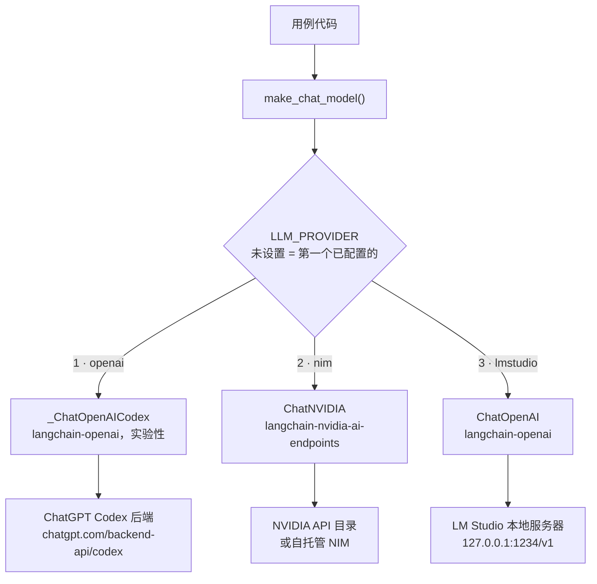
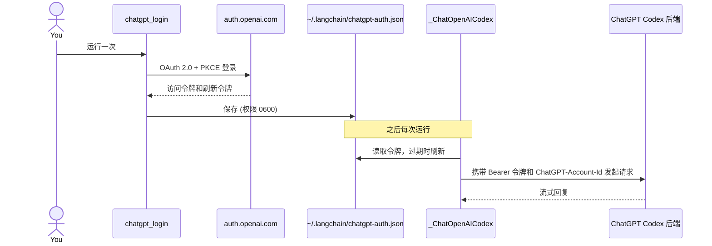

# 推理层

Jev 返回的是类型化的判断，因此回复仍然由聊天模型来写。`pilot_jev.llm.make_chat_model` 根据环境变量构建聊天模型，各个用例的代码中完全不涉及具体的提供方。

三种提供方，按优先级排列：

| # | `LLM_PROVIDER` | 后端 | 认证 |
| --- | --- | --- | --- |
| 1 | `openai` | 通过 Codex 后端使用 ChatGPT 订阅 | ChatGPT OAuth 登录，无需 API 密钥 |
| 2 | `nim` | NVIDIA NIM | `NVIDIA_API_KEY` |
| 3 | `lmstudio` | LM Studio 本地服务器 | 无 |



未设置 `LLM_PROVIDER` 时，第一个已配置的提供方生效：如果已登录 ChatGPT，则使用 `openai`；否则如果设置了 `NVIDIA_API_KEY` 或 `NVIDIA_BASE_URL`，则使用 `nim`；再否则使用 `lmstudio`。显式设置 `LLM_PROVIDER` 时，始终以它为准。 `.env.sample` 里的占位值不算已配置。自动选择无法得知你的 ChatGPT 套餐是否已用完额度，用完时请自己设置 `LLM_PROVIDER`。

| 变量 | 默认值 | 含义 |
| --- | --- | --- |
| `LLM_PROVIDER` | 第一个已配置的 | `openai`、`nim` 或 `lmstudio` |
| `LLM_MODEL` | 因提供方而异 | 模型 ID |
| `LLM_TIMEOUT` | `180` | 每次请求的超时秒数 |
| `LLM_ENABLE_THINKING` | 未设置 | `false` 表示对 NIM 推理模型关闭思考 |

## 1. OpenAI 订阅（ChatGPT Codex OAuth）

使用你的 ChatGPT 订阅，而不是 OpenAI API 密钥。它**不是**公开的 `api.openai.com` API：`langchain-openai` 内置了一个实验性的 `_ChatOpenAICodex`，通过 ChatGPT OAuth（PKCE）登录并调用 ChatGPT Codex 后端，思路与 Hermes Agent 的 `openai-codex` 提供方相同。把 OAuth 令牌直接传给 `ChatOpenAI` 是行不通的。

```bash
uv run python -m pilot_jev.chatgpt_login   # opens a browser and waits up to 15 minutes
```

登录过程会在 `http://localhost:1455` 上监听回调，因此需要在同一台机器上有浏览器。`chatgpt_login --device`（设备码方式，适用于无头机器）虽然存在，但目前会失败：在 `langchain-openai` 1.6.2 下，OpenAI 返回 HTTP 400，原因是该库发送的是表单编码的请求体，而接口现在要求 JSON。

模型名称因账户和订阅方案而异。请先列出你的账户提供哪些模型，再设置 `LLM_MODEL`：

```bash
uv run python -m pilot_jev.chatgpt_models   # prints model IDs only, never the token
```

```dotenv
LLM_PROVIDER=openai
LLM_MODEL=...              # default gpt-5.5, from the langchain-openai docs
```

列出的名称仍然可能失败：有些模型会被 ChatGPT 账户拒绝（HTTP 400），有些模型则可能已超出其使用额度（HTTP 429）。



需要了解：

- **实验性且非官方。** 相关类是私有的（`_ChatOpenAICodex`），随时可能变化。请仅在你的 OpenAI 账户、订阅方案以及适用的 OpenAI 条款允许使用 ChatGPT 认证的 Codex 访问时才使用，合规责任由你自己承担。对于共享或生产环境，建议改用 API 密钥、Azure OpenAI 或内部网关。
- 令牌保存在 `~/.langchain/chatgpt-auth.json`，**而不是** `~/.codex/auth.json`。从其他程序刷新 Codex CLI 的令牌可能会破坏 Codex CLI 的会话，因此本仓库从不触碰那个文件。
- 该后端只支持流式返回。`invoke` 仍会返回一条聚合后的消息。
- 调用会计入你的 ChatGPT 订阅方案额度。

## 2. NVIDIA NIM

包：`langchain-nvidia-ai-endpoints`，类：`ChatNVIDIA`。不存在名为 `langchain-nvidia-nim` 的包。

```dotenv
LLM_PROVIDER=nim
NVIDIA_API_KEY=nvapi-...
# LLM_MODEL=nvidia/nemotron-3.5-lightning-30b-a3b   (default)
# NVIDIA_BASE_URL=http://0.0.0.0:8000/v1            (self-hosted NIM)
```

在 https://build.nvidia.com 获取密钥。我们通过 `ChatNVIDIA` 测试了两个模型，每个都回答了一个普通问题，并发出了一次工具调用：

| 模型 | 对话 | 工具调用 |
| --- | --- | --- |
| `nvidia/nemotron-3.5-lightning-30b-a3b`（默认） | 是 | 是 |
| `z-ai/glm-5.3-flash` | 是 | 是 |

需要了解：

- **延迟高且不稳定。** 托管服务上的单次调用耗时大约 6 到 160 秒，因此 `LLM_TIMEOUT` 默认为 180 秒。客户端默认的 60 秒超时会导致 `doctor.py` 失败。
- **目录中列出不代表模型可用。** 包括 `meta/llama-3.3-70b-instruct` 在内的若干已列出的模型，由于已经下线而返回 `410 Gone`。在依赖某个模型之前，请先实际调用一次。
- **推理模型**可能会花时间思考，而 `nvidia/nemotron-3.5-lightning-30b-a3b` 有时会把思考内容混进回复里。`LLM_ENABLE_THINKING=false` 会发送 `chat_template_kwargs.enable_thinking: false`。
- **连接可能被重置。** `ChatNVIDIA` 没有重试设置，所以 `pilot_jev.retry.with_retries` 会在遇到连接错误、超时以及 HTTP 429 或 5xx 时重试聊天模型调用（401、403、404 不重试）。它只包裹这一次调用，用在 Case 01 的 `answer` 节点和一个智能体中间件里，绝不包裹整次图运行：重放会再次调用并计费 Jev。这里从不重试 Jev 错误，因为 TypeSafe SDK 已经自带重试。
- 实测行为和尚未解决的问题见 [05-verification-zh-CN.md](05-verification-zh-CN.md)。

### 把密钥保存在 macOS 钥匙串中

```bash
security add-generic-password -a pilot-typesafeai-jev -s "NVIDIA API Key" -w    # prompts for the value
NVIDIA_API_KEY="$(security find-generic-password -s 'NVIDIA API Key' -a pilot-typesafeai-jev -w)" \
  uv run python doctor.py
```

## 3. LM Studio

LM Studio 提供与 OpenAI 兼容的 API，因此 `ChatOpenAI` 只需指定自定义的 `base_url` 就能与它通信。

```dotenv
LLM_PROVIDER=lmstudio
LLM_MODEL=google/gemma-4-e4b
# LMSTUDIO_BASE_URL=http://127.0.0.1:1234/v1
```

1. 从 https://lmstudio.ai 安装 LM Studio，并下载一个支持工具调用的模型。
2. 启动本地服务器：**Developer**、**Local Server**，状态为 **Running**，或者运行 `lms server start`。
3. 加载模型时，**上下文长度至少为 16384**（这里使用的是 32768）：`lms load google/gemma-4-e4b --context-length 32768`。
4. 运行 `uv run python doctor.py`。它会检查服务器是否响应，以及模型是否在列表中。

Deep Agents 会额外加入约 5,800 个 token 的系统提示词，所以默认的 4096 上下文长度在第一次回复之前就会失败。LM Studio 不校验 API 密钥，代码发送的是 `lm-studio`。

## 重试

`pilot_jev.retry.with_retries` 是三个后端唯一的重试负责方。一次逻辑上的聊天模型调用最多尝试 3 次（第一次调用加两次
重试）。ChatGPT 和 LM Studio 的模型以 `max_retries=0` 创建，`ChatNVIDIA` 没有重试设置，所以不会有供应商 SDK 在此之上
再叠加自己的尝试。如果重新打开供应商的重试，两层会相乘。

- **重试哪些：** 连接错误、超时，以及 NIM 的 HTTP 429、500、502、503、504。对 OpenAI 客户端的错误（ChatGPT 和
  LM Studio）沿用此前 SDK 的策略：HTTP 408、409、429 和所有 5xx，若带有 `x-should-retry` 头则以它为准。没有状态码、消息表示服务器过载的流式错误事件也会重试。绝不重试
  400、401、403、404，也不重试表示套餐或配额已用完的 429（`usage_limit_reached`、`insufficient_quota`），因为等待并不能
  解决这些问题。Jev 的错误不在这里重试，因为 TypeSafe SDK 自己会重试。
- **等待多久：** 带抖动的指数退避（抖动前为 5 秒、10 秒），上限 60 秒。如果错误带有 `Retry-After` 头（秒数或 HTTP 日期），
  则以它作为等待时间，同样有上限。
- **如何观察：** 每次重试都会传给可选的 `on_retry(attempt, error)` 回调，并记录到 `pilot_jev.retry` 日志器，内容是错误
  类型和 HTTP 状态，不包含错误消息。
- **适用位置：** Case 01 的 `answer` 节点、Case 02 的 `RetryModelCalls` 中间件，以及 `doctor.py` 的实际调用检查。不会用于
  整个图或智能体的运行，因为重放会再次调用 Jev。

## 如何选择

| | OpenAI 订阅 | NVIDIA NIM（托管） | LM Studio |
| --- | --- | --- | --- |
| 密钥 | ChatGPT 登录 | `NVIDIA_API_KEY` | 无 |
| 成本 | 受你的 ChatGPT 订阅方案额度限制 | 按 token 计费，取决于你的方案 | 免费，使用你自己的硬件 |
| 速度 | 见 [05-verification-zh-CN.md](05-verification-zh-CN.md) | 测试中每次调用 6 到 160 秒 | 取决于硬件和模型 |
| 网络 | 需要 | 需要 | 聊天模型不需要 |
| 状态 | 实验性，非官方 | 稳定的客户端 | 稳定的客户端 |

无论哪种配置，Jev 都是托管 API，因此始终需要 `TYPESAFE_API_KEY` 和网络访问。
