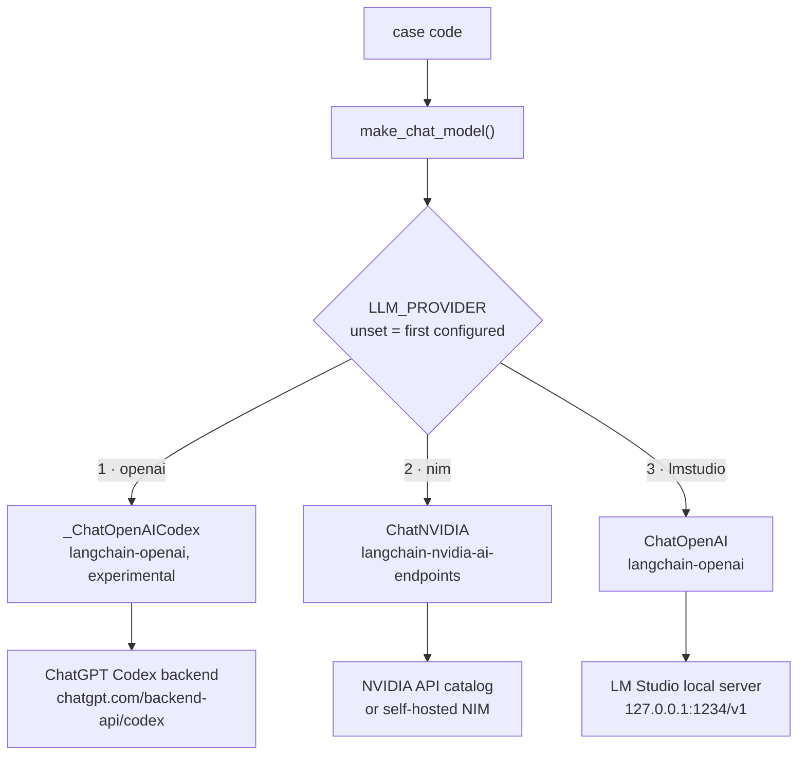
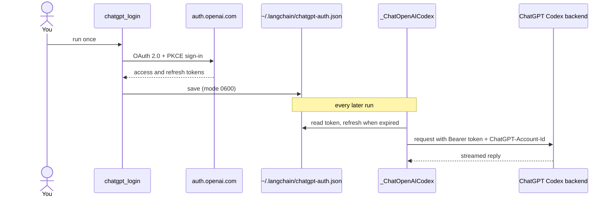

# Inference layer

Jev returns typed judgments, so replies still come from a chat model. `pilot_jev.llm.make_chat_model`
builds it from environment variables, and the cases never mention a provider.

Three providers, in priority order:

| # | `LLM_PROVIDER` | Backend | Auth |
| --- | --- | --- | --- |
| 1 | `openai` | ChatGPT subscription through the Codex backend | ChatGPT OAuth sign-in, no API key |
| 2 | `nim` | NVIDIA NIM | `NVIDIA_API_KEY` |
| 3 | `lmstudio` | LM Studio local server | none |



When `LLM_PROVIDER` is unset the first configured provider wins: `openai` if you have signed in to
ChatGPT, else `nim` if `NVIDIA_API_KEY` or `NVIDIA_BASE_URL` is set, else `lmstudio`. Setting
`LLM_PROVIDER` always overrides that.

| Variable | Default | Meaning |
| --- | --- | --- |
| `LLM_PROVIDER` | first configured | `openai`, `nim`, or `lmstudio` |
| `LLM_MODEL` | per provider | model id |
| `LLM_TIMEOUT` | `180` | seconds per request |
| `LLM_ENABLE_THINKING` | unset | `false` turns thinking off for NIM reasoning models |

## 1. OpenAI subscription (ChatGPT Codex OAuth)

Uses your ChatGPT subscription instead of an OpenAI API key. It is **not** the public
`api.openai.com` API: `langchain-openai` ships an experimental `_ChatOpenAICodex` that signs in with
ChatGPT OAuth (PKCE) and calls the ChatGPT Codex backend, the same idea Hermes Agent uses for its
`openai-codex` provider. Passing an OAuth token to `ChatOpenAI` does not work.

```bash
uv run python -m pilot_jev.chatgpt_login   # opens a browser and waits up to 15 minutes
```

The sign-in listens on `http://localhost:1455` for the callback, so it needs a browser on the same
machine. `chatgpt_login --device` (device code, for headless machines) exists but currently fails: with
`langchain-openai` 1.6.2 OpenAI answers HTTP 400 because the library sends a form-encoded body where
the endpoint now wants JSON.

Model names differ per account and plan. List what yours offers, then set `LLM_MODEL`:

```bash
uv run python -m pilot_jev.chatgpt_models   # prints model IDs only, never the token
```

```dotenv
LLM_PROVIDER=openai
LLM_MODEL=...              # default gpt-5.5, from the langchain-openai docs
```

A listed name can still fail: some are rejected for ChatGPT accounts (HTTP 400), and a model can be
over its usage limit (HTTP 429).



Things to know:

- **Experimental and unofficial.** The classes are private (`_ChatOpenAICodex`) and may change.
  Use this only where your OpenAI account, plan, and the applicable OpenAI terms allow
  ChatGPT-authenticated Codex access. You are responsible for that. For shared or production use,
  prefer an API key, Azure OpenAI, or an internal gateway.
- The token lives in `~/.langchain/chatgpt-auth.json`, **not** in `~/.codex/auth.json`. Refreshing
  the Codex CLI token from another program can break Codex CLI sessions, so this repo never touches
  that file.
- The backend only streams. `invoke` still returns one aggregated message.
- Calls count against your ChatGPT plan limits.

## 2. NVIDIA NIM

Package: `langchain-nvidia-ai-endpoints`, class `ChatNVIDIA`. There is no package called
`langchain-nvidia-nim`.

```dotenv
LLM_PROVIDER=nim
NVIDIA_API_KEY=nvapi-...
# LLM_MODEL=nvidia/nemotron-3.5-lightning-30b-a3b   (default)
# NVIDIA_BASE_URL=http://0.0.0.0:8000/v1            (self-hosted NIM)
```

Get a key at https://build.nvidia.com. Two models were tested through `ChatNVIDIA`, each answering a
plain question and emitting a tool call:

| Model | Chat | Tool call |
| --- | --- | --- |
| `nvidia/nemotron-3.5-lightning-30b-a3b` (default) | yes | yes |
| `z-ai/glm-5.3-flash` | yes | yes |

Things to know:

- **Latency is high and uneven.** Single hosted calls took roughly 6 to 160 seconds, so
  `LLM_TIMEOUT` defaults to 180 seconds. The 60 second client default failed `doctor.py`.
- **The catalog list is not proof a model works.** Several listed models, including
  `meta/llama-3.3-70b-instruct`, returned `410 Gone` because they reached end of life. Call a model
  before relying on it.
- **Reasoning models** may spend time thinking, and `nvidia/nemotron-3.5-lightning-30b-a3b`
  sometimes put its thinking into the reply. `LLM_ENABLE_THINKING=false` sends
  `chat_template_kwargs.enable_thinking: false`.
- **Connections can reset.** `ChatNVIDIA` has no retry setting, so `pilot_jev.retry.with_retries`
  retries the whole graph call on connection errors, timeouts, and HTTP 429 or 5xx. It never retries
  Jev errors, because the TypeSafe SDK already retries and a replay would call Jev again.
- Measured behavior and open problems are in [05-verification.md](05-verification.md).

### Keep the key in the macOS keychain

```bash
security add-generic-password -a pilot-typesafeai-jev -s "NVIDIA API Key" -w    # prompts for the value
NVIDIA_API_KEY="$(security find-generic-password -s 'NVIDIA API Key' -a pilot-typesafeai-jev -w)" \
  uv run python doctor.py
```

## 3. LM Studio

LM Studio serves an OpenAI-compatible API, so `ChatOpenAI` talks to it with a custom `base_url`.

```dotenv
LLM_PROVIDER=lmstudio
LLM_MODEL=google/gemma-4-e4b
# LMSTUDIO_BASE_URL=http://127.0.0.1:1234/v1
```

1. Install LM Studio from https://lmstudio.ai and download a model with tool calling support.
2. Start the local server: **Developer**, **Local Server**, status **Running**, or `lms server start`.
3. Load the model with a **context length of at least 16384** (32768 was used here):
   `lms load google/gemma-4-e4b --context-length 32768`.
4. Run `uv run python doctor.py`. It checks that the server responds and the model is listed.

Deep Agents adds about 5,800 tokens of system prompt, so the default 4096 context fails before the
first reply. LM Studio does not validate the API key; the code sends `lm-studio`.

## Choosing

| | OpenAI subscription | NVIDIA NIM (hosted) | LM Studio |
| --- | --- | --- | --- |
| Key | ChatGPT sign-in | `NVIDIA_API_KEY` | none |
| Cost | your ChatGPT plan limits | per token, subject to your plan | free, uses your hardware |
| Speed | see [05-verification.md](05-verification.md) | 6 to 160 s per call in testing | depends on hardware and model |
| Network | required | required | not needed for the chat model |
| Status | experimental, unofficial | stable client | stable client |

Jev is a hosted API in every setup, so `TYPESAFE_API_KEY` and network access are always required.
