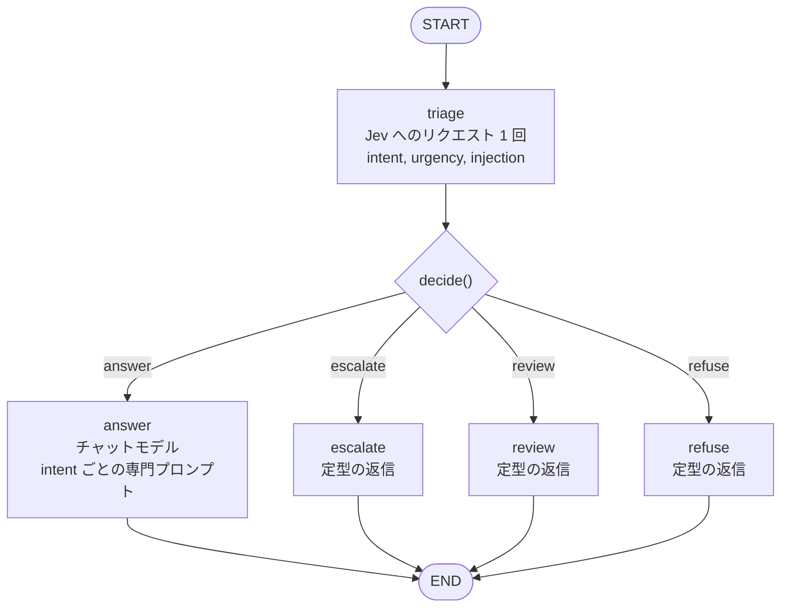
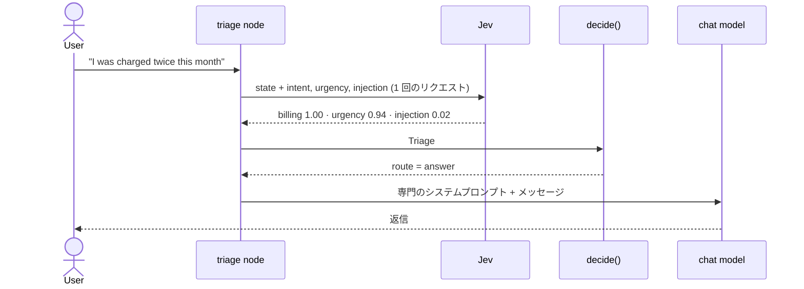
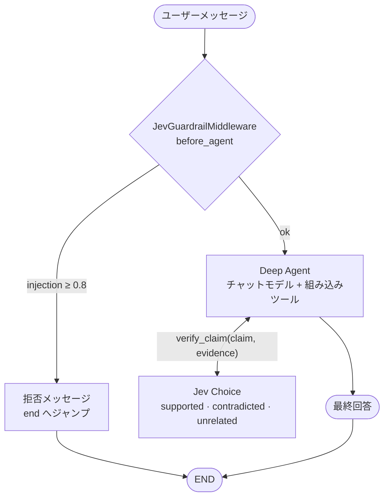
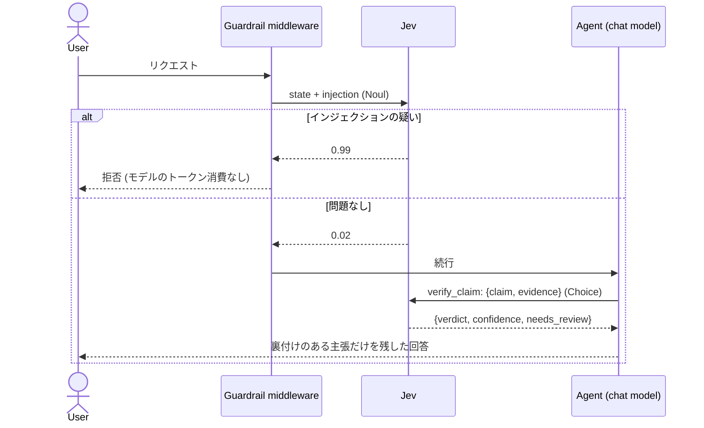

# ケース

どちらのケースも `src/` 配下にあり、`pilot_jev/` を共有します。

## Case 01: LangGraph のルーターとしての Jev

コードは `src/case01_routing/graph.py` にあります。ポリシーは `src/pilot_jev/triage.py` です。

### グラフ

チャットモデルのトークンを消費するのは `answer` だけです。ほかの 3 つのルートは LLM を呼び出さずに返信します。

### 1 通のメッセージを端から端まで

### 3 つの質問

| 質問 | プリミティブ | 意味 |
| --- | --- | --- |
| `intent` | `Choice` | `billing`、`technical`、`account`、`chitchat`、`other` |
| `urgency` | `Score` | 0 は後回しでよい、1 は近いうちに対応が必要、2 は緊急で作業が止まっている |
| `injection` | `Noul` | メッセージが指示の上書きや隠しプロンプトの開示を試みている |

### ルーティングポリシー（`decide`）

上から順に評価し、最初に一致したものが採用されます。値は `Policy` にあるチューニング前の出発点です。

| 順序 | 条件 | ルート | チャットモデルの呼び出し |
| --- | --- | --- | --- |
| 1 | `injection >= 0.8` | `refuse` | なし |
| 2 | `urgency >= 1.5` | `escalate` | なし |
| 3 | `intent == "other"` または `intent_confidence < 0.5` | `review` | なし |
| 4 | 上記以外 | `answer` | あり |

比較式は、値が NaN の場合にチャットモデルへ到達せず、安全側（`refuse`、`escalate`、`review`）に倒れるように書かれています。

拒否を緊急対応より優先するのは、悪意のあるメッセージが緊急案件として担当者のキューに届くべきではないためです。緊急対応を不確実性より優先するのは、intent が不明確でも緊急のメッセージには人間の対応が必要だからです。

グラフは `build_graph(jev=..., llm=..., policy=...)` で構築します。バックエンドは遅延解決されるため、モジュールをインポートするだけなら認証情報は不要で、テストではフェイクを注入できます。チャットモデルはイベントループの外で 1 回だけ構築されます。NIM クライアントは作成時にブロッキング I/O を行うためです。テキストのないメッセージは、Jev を呼び出さずにそのまま `review` へ進みます。

## Case 02: Deep Agent の中の Jev

コードは `src/case02_deepagents/graph.py` にあります。

### 2 つの統合ポイント

### シーケンス

### `JevGuardrailMiddleware`

`before_agent` と `abefore_agent` を実装しています。最新のユーザーメッセージに対して `Noul` の質問を 1 つ投げ、0.8 以上（`Policy.injection_block` と同じ値）であれば `jump_to: "end"` を付けて拒否を返します。そのため、モデルと約 5,800 トークンのシステムプロンプトは一切使われません。入力が空の場合は Jev を呼び出しません。

### `verify_claim` ツール

エージェントは `claim` と、見つけた `evidence` を渡します。Jev はそれらを名前付きの JSON フィールドとして受け取り、`Choice` を 1 つ答えます。

| 判定 | 意味 |
| --- | --- |
| `supported` | 根拠が主張を述べている、または明確に示唆している |
| `contradicted` | 根拠が主張と矛盾している |
| `unrelated` | 根拠が主張に触れていない |

ツールは、判定、確信度、確率、`needs_review`（確信度が 0.6 未満。チューニング前の出発点）を含む JSON を返します。システムプロンプトでは、contradicted または unrelated の主張は捨てるようエージェントに指示しています。Jev 自体が失敗した場合、ツールは実行全体を中断せず、モデルにテキストとして見える `ToolException` を送出します。

### `make_agent` と `make_graph`

`make_agent(llm, jev)` はモジュールレベルのグラフではなくファクトリーです。チャットモデルの構築に認証情報が必要なためです。`make_graph()` は `langgraph.json` 用の引数なしの `async` ラッパーで、`langgraph.json` は 3 つ以上のパラメーターを持つファクトリーを受け付けません。エージェントはワーカースレッドの中で 1 回だけ構築されます。

## テスト

`uv run pytest` はオフラインで実行されます。フェイクの Jev が本物の `SystemOneResponse` オブジェクトを返すため、レスポンスのパース処理も検証されます。チャットモデルはフェイクで、モデルを呼び出してはならないルートには、触れると例外を送出するモデルを使っています。

| ファイル | 対象 |
| --- | --- |
| `tests/test_triage.py` | 質問の形、パース、ポリシーの優先順位と境界値、NaN は安全側に倒れること |
| `tests/test_jev.py` | ゲートウェイが state と questions をそのまま渡し、モデルを選択すること |
| `tests/test_text.py` | メッセージ内容からのテキスト抽出 |
| `tests/test_llm.py` | provider の優先順位と自動選択、ChatGPT のサインイン確認、NIM と LM Studio の引数、タイムアウト、thinking の切り替え |
| `tests/test_retry.py` | 接続エラーと NIM の 429/5xx はリトライし、Jev のエラーと本物のバグはリトライしない |
| `tests/test_case01_graph.py` | 4 つのルート、ファンアウトは 1 回の呼び出し、answer 以外のルートではチャットモデルを呼ばない、空入力、専門プロンプト |
| `tests/test_case02_deepagents.py` | ミドルウェアの同期版と非同期版、空入力と NaN、ツールの判定と Jev の失敗、インジェクションあり・なしでのエージェント全体 |
