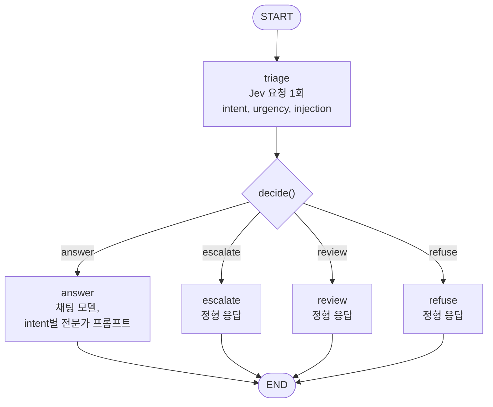
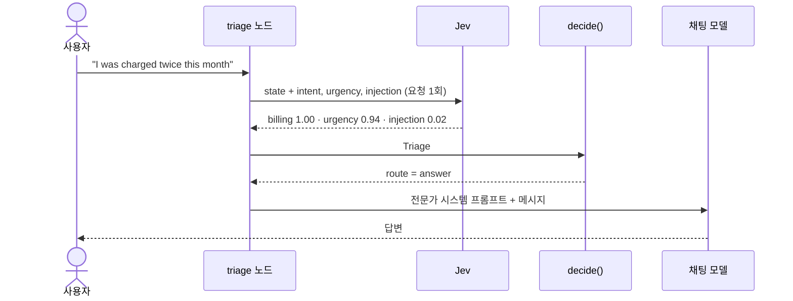
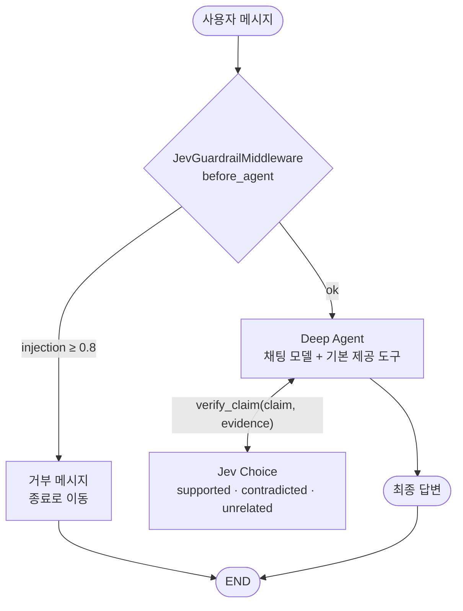
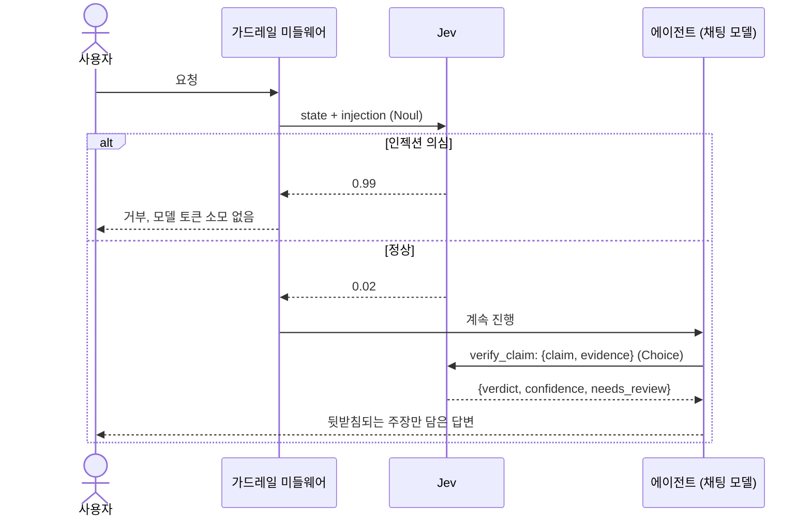

# 케이스

두 케이스 모두 `src/` 아래에 있으며 `pilot_jev/`를 공유합니다.

## Case 01: LangGraph 라우터로서의 Jev

코드는 `src/case01_routing/graph.py`에 있고, 정책은 `src/pilot_jev/triage.py`에 있습니다.

### 그래프

채팅 모델 토큰을 쓰는 경로는 `answer`뿐입니다. 나머지 세 경로는 LLM 호출 없이 응답합니다.

### 메시지 하나의 전체 흐름

### 세 가지 질문

| 질문 | 기본 요소 | 의미 |
| --- | --- | --- |
| `intent` | `Choice` | `billing`, `technical`, `account`, `chitchat`, `other` |
| `urgency` | `Score` | 0은 기다려도 됨, 1은 곧 확인이 필요함, 2는 긴급하며 진행이 막힘 |
| `injection` | `Noul` | 메시지가 지시를 덮어쓰거나 숨겨진 프롬프트를 드러내려 함 |

### 라우팅 정책 (`decide`)

위에서부터 순서대로 검사하며 처음 일치하는 조건이 적용됩니다. 값은 `Policy`에 있는, 튜닝하지 않은 출발점입니다.

| 순서 | 조건 | 경로 | 채팅 모델 호출 |
| --- | --- | --- | --- |
| 1 | `injection >= 0.8` | `refuse` | 아니요 |
| 2 | `urgency >= 1.5` | `escalate` | 아니요 |
| 3 | `intent == "other"` 또는 `intent_confidence < 0.5` | `review` | 아니요 |
| 4 | 그 외 | `answer` | 예 |

비교식은 NaN 값이 들어오면 채팅 모델에 도달하지 않고 `refuse`, `escalate`, `review` 중 하나로 안전하게 실패(fail closed)하도록 작성되어 있습니다.

적대적인 메시지가 긴급 건으로 담당자의 큐에 올라가서는 안 되므로, 거부가 긴급도보다 우선합니다. 의도가 불분명해도 긴급한 메시지에는 여전히 사람이 필요하므로, 긴급도는 불확실성보다 우선합니다.

`build_graph(jev=..., llm=..., policy=...)`로 그래프를 만듭니다. 백엔드는 지연 방식으로 결정되므로 모듈을 import하는 데 자격 증명이 필요 없고, 테스트에서는 가짜 객체를 주입합니다. 채팅 모델은 NIM 클라이언트가 생성 시점에 블로킹 I/O를 수행하기 때문에 이벤트 루프 밖에서 한 번만 만듭니다. 텍스트가 없는 메시지는 Jev를 호출하지 않고 곧바로 `review`로 갑니다.

## Case 02: Deep Agent 안의 Jev

코드는 `src/case02_deepagents/graph.py`에 있습니다.

### 두 가지 통합 지점

### 시퀀스

### `JevGuardrailMiddleware`

`before_agent`와 `abefore_agent`를 구현합니다. 가장 최근 사용자 메시지에 대해 `Noul` 질문 하나를 던지고, 값이 0.8 이상이면(`Policy.injection_block`과 같은 값) `jump_to: "end"`와 함께 거부 응답을 반환합니다. 그래서 모델과 약 5,800 토큰의 시스템 프롬프트는 전혀 사용되지 않습니다. 입력이 비어 있으면 Jev 호출을 건너뜁니다.

### `verify_claim` 도구

에이전트는 `claim`과 자신이 찾은 `evidence`를 전달합니다. Jev는 이를 이름 붙인 JSON 필드로 받아 `Choice` 하나로 답합니다.

| 판정 | 의미 |
| --- | --- |
| `supported` | 근거가 주장을 직접 진술하거나 분명히 함의함 |
| `contradicted` | 근거가 주장과 충돌함 |
| `unrelated` | 근거가 주장을 다루지 않음 |

이 도구는 판정, 신뢰도, 확률, `needs_review`(신뢰도 0.6 미만이며, 튜닝하지 않은 출발점)를 담은 JSON을 반환합니다. 시스템 프롬프트는 에이전트에게 contradicted 또는 unrelated 주장을 버리도록 지시합니다. Jev 자체가 실패하면 실행 전체를 중단하는 대신 `ToolException`을 발생시키고, 모델은 이를 텍스트로 확인합니다.

### `make_agent`와 `make_graph`

`make_agent(llm, jev)`는 모듈 수준 그래프가 아니라 팩토리입니다. 채팅 모델을 만들려면 자격 증명이 필요하기 때문입니다. `make_graph()`는 `langgraph.json`용 인자 없는 `async` 래퍼이며, `langgraph.json`은 매개변수가 두 개를 넘는 팩토리를 허용하지 않습니다. 에이전트는 워커 스레드에서 한 번만 만듭니다.

## 테스트

`uv run pytest`는 오프라인으로 실행됩니다. 가짜 Jev가 실제 `SystemOneResponse` 객체를 반환하므로 응답 파싱까지 검증됩니다. 채팅 모델은 가짜이고, 모델을 호출하면 안 되는 경로에는 건드리면 예외를 던지는 모델을 사용합니다.

| 파일 | 검증 대상 |
| --- | --- |
| `tests/test_triage.py` | 질문 형태, 파싱, 정책 우선순위와 경계값, NaN은 안전하게 실패 |
| `tests/test_jev.py` | 게이트웨이가 state와 질문을 그대로 전달하고 모델을 선택함 |
| `tests/test_text.py` | 메시지 content에서 텍스트 추출 |
| `tests/test_llm.py` | 프로바이더 우선순위와 자동 선택, ChatGPT 로그인 확인, NIM과 LM Studio 인자, 타임아웃, thinking 토글 |
| `tests/test_retry.py` | 연결 오류와 NIM 429/5xx는 재시도하고, Jev 오류와 실제 버그는 재시도하지 않음 |
| `tests/test_case01_graph.py` | 네 가지 경로, 단일 fan-out 호출, answer가 아닌 경로에서는 채팅 모델 미사용, 빈 입력, 전문가 프롬프트 |
| `tests/test_case02_deepagents.py` | 미들웨어 동기/비동기, 빈 입력과 NaN, 도구 판정과 Jev 실패, 인젝션 유무에 따른 전체 에이전트 |
