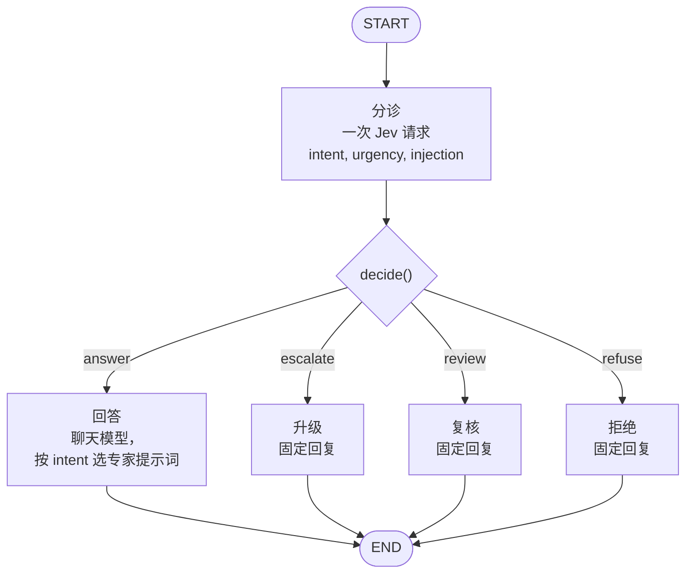
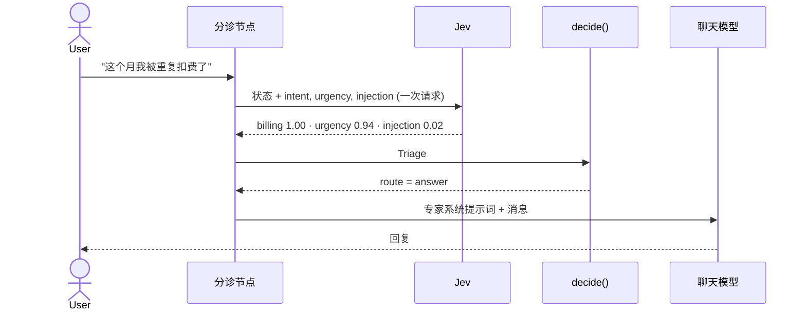
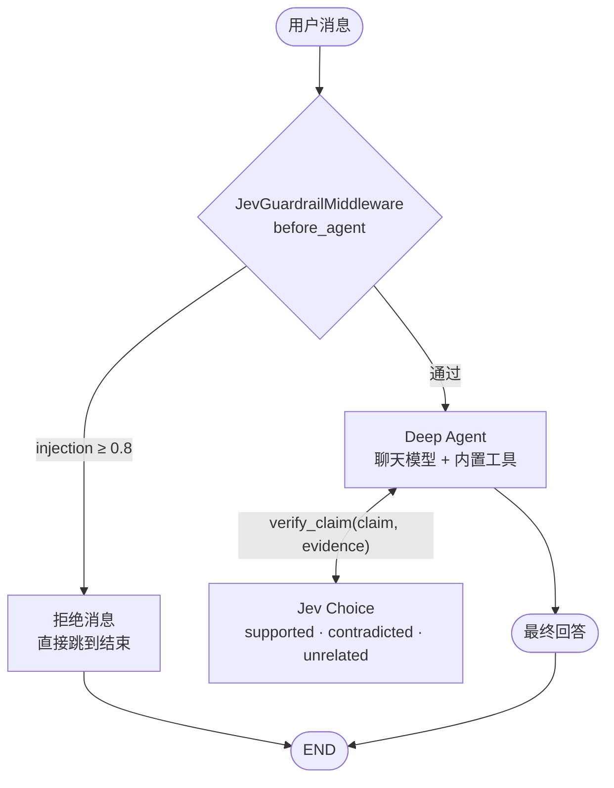
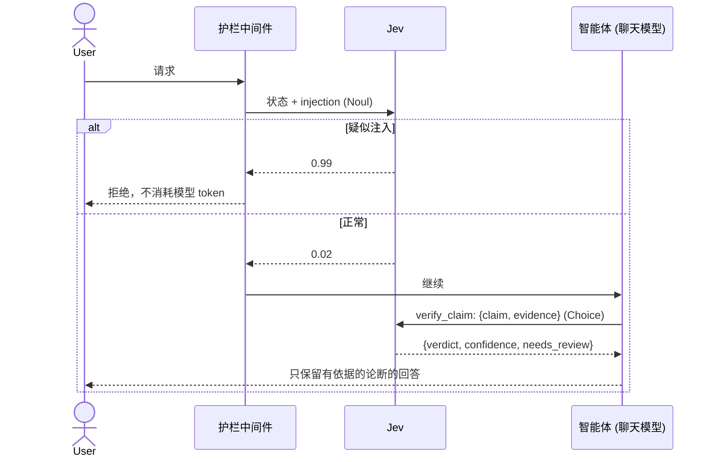

# 用例

两个用例都位于 `src/` 下，并共用 `pilot_jev/`。

## Case 01：Jev 作为 LangGraph 路由器

代码：`src/case01_routing/graph.py`。策略位于 `src/pilot_jev/triage.py`。

### 图

只有 `answer` 会消耗聊天模型的 token。其余三条路由不调用 LLM 就直接回复。

### 一条消息的完整流程

### 三个问题

| 问题 | 基本类型 | 含义 |
| --- | --- | --- |
| `intent` | `Choice` | `billing`、`technical`、`account`、`chitchat`、`other` |
| `urgency` | `Score` | 0 可以等待，1 需要尽快处理，2 紧急且已阻塞 |
| `injection` | `Noul` | 消息试图覆盖指令或套取隐藏的提示词 |

### 路由策略（`decide`）

按顺序检查，先匹配者生效。这些数值是 `Policy` 中未经调优的起始值。

| 顺序 | 条件 | 路由 | 是否调用聊天模型 |
| --- | --- | --- | --- |
| 1 | `injection >= 0.8` | `refuse` | 否 |
| 2 | `urgency >= 1.5` | `escalate` | 否 |
| 3 | `intent == "other"` 或 `intent_confidence < 0.5` | `review` | 否 |
| 4 | 其他情况 | `answer` | 是 |

这些比较的写法保证了遇到 NaN 值时会“失败即收紧”（fail closed），转到 `refuse`、`escalate` 或 `review`，而不会走到聊天模型。

拒绝的优先级高于紧急，因为恶意消息不应该以“紧急”的身份进入人工队列。紧急的优先级高于不确定，因为即使意图不明确，紧急消息仍然需要人来处理。

`build_graph(jev=..., llm=..., policy=...)` 用于构建该图。后端采用惰性解析，所以导入模块不需要任何凭据，测试时也可以注入 fake 对象。聊天模型只构建一次，并且在事件循环之外构建，因为 NIM 客户端在创建时会做阻塞式 I/O。没有文本的消息会直接进入 `review`，不会调用 Jev。

## Case 02：Deep Agent 中的 Jev

代码：`src/case02_deepagents/graph.py`。

### 两个集成点

### 时序

### `JevGuardrailMiddleware`

实现了 `before_agent` 和 `abefore_agent`。它针对最新一条用户消息提出一个 `Noul` 问题。当结果达到或超过 0.8（即同一个 `Policy.injection_block`）时，返回一条拒绝消息并带上 `jump_to: "end"`，因此模型及其约 5,800 token 的系统提示词都不会被用到。空输入会跳过 Jev 调用。

### `verify_claim` 工具

智能体传入一个 `claim` 和它找到的 `evidence`。Jev 以具名 JSON 字段的形式接收它们，并回答一个 `Choice`：

| 结论 | 含义 |
| --- | --- |
| `supported` | 证据明确陈述或清楚地暗示了该论断 |
| `contradicted` | 证据与该论断相矛盾 |
| `unrelated` | 证据没有涉及该论断 |

该工具返回包含结论、置信度、各项概率和 `needs_review`（置信度低于 0.6，未经调优的起始值）的 JSON。系统提示词会告诉智能体丢弃被反驳或无关的论断。如果 Jev 本身失败，该工具会抛出一个 `ToolException`，模型会以文本形式看到它，而不是让整个运行中止。

### `make_agent` 和 `make_graph`

`make_agent(llm, jev)` 是一个工厂函数，而不是模块级的图，因为构建聊天模型需要凭据。`make_graph()` 是它的零参数 `async` 封装，供 `langgraph.json` 使用，因为后者不接受参数超过两个的工厂函数。它只构建一次智能体，并在工作线程中完成。

## 测试

`uv run pytest` 离线运行。fake Jev 返回真实的 `SystemOneResponse` 对象，因此响应解析确实被测试到了。聊天模型都是 fake，而那些不应调用模型的路由，使用的是一旦被触碰就会抛出异常的模型。

| 文件 | 覆盖内容 |
| --- | --- |
| `tests/test_triage.py` | 问题结构、解析、策略优先级与边界、NaN 失败即收紧 |
| `tests/test_jev.py` | 网关透传状态和问题，并选择模型 |
| `tests/test_text.py` | 从消息内容中提取文本 |
| `tests/test_llm.py` | 提供方优先级与自动选择、ChatGPT 登录检查、NIM 和 LM Studio 参数、超时、思考开关 |
| `tests/test_retry.py` | 重试连接错误以及 NIM 的 429/5xx，绝不重试 Jev 错误和真正的 bug |
| `tests/test_case01_graph.py` | 四条路由、单次扇出调用、非 answer 路由不调用聊天模型、空输入、专家提示词 |
| `tests/test_case02_deepagents.py` | 中间件的同步与异步、空输入与 NaN、工具结论与 Jev 失败、有无注入时的完整智能体 |
