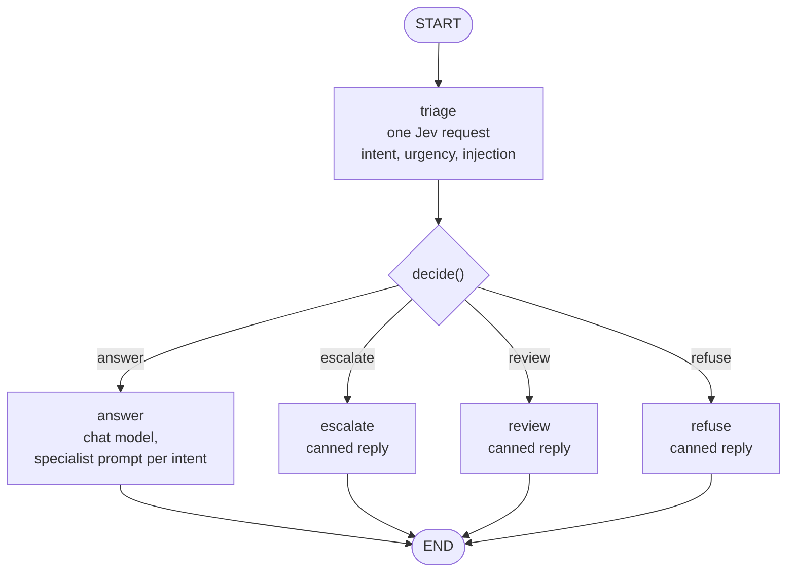
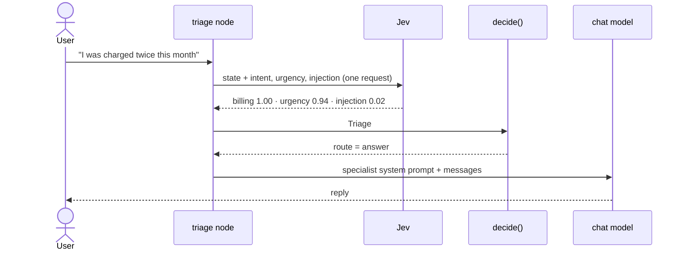
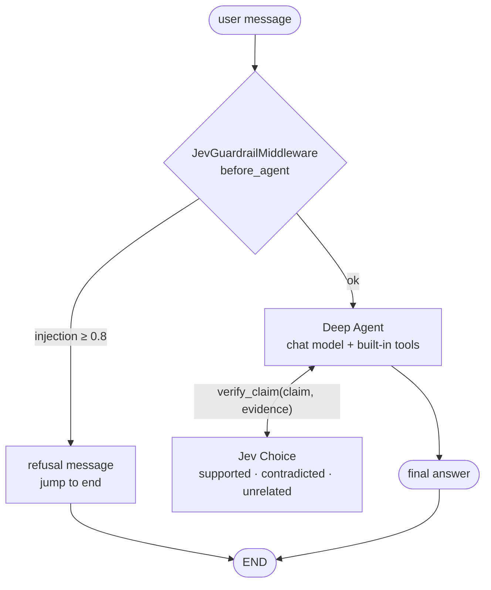
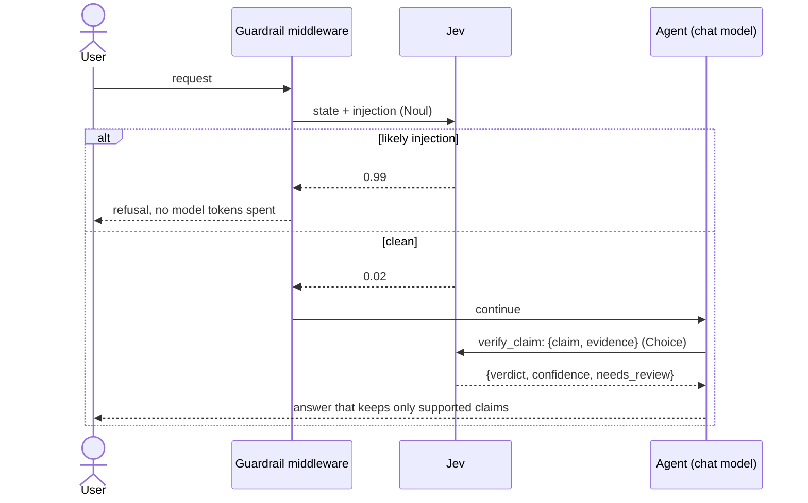

# Cases

The cases live under `src/` and share `pilot_jev/`. Case 03 is a small integration check for the LangChain package, not a new experiment.

## Case 01: Jev as a LangGraph router

Code: `src/case01_routing/graph.py`. The policy is in `src/pilot_jev/triage.py`.

### Graph



Only `answer` spends chat model tokens. The other three routes reply without an LLM call.

### One message, end to end



### The three questions

| Question | Primitive | Meaning |
| --- | --- | --- |
| `intent` | `Choice` | `billing`, `technical`, `account`, `chitchat`, `other` |
| `urgency` | `Score` | 0 can wait, 1 needs attention soon, 2 urgent and blocking |
| `injection` | `Noul` | the message tries to override instructions or reveal hidden prompts |

### Routing policy (`decide`)

Checked in order, first match wins. The values are untuned starting points in `Policy`.

| Order | Condition | Route | Chat model called |
| --- | --- | --- | --- |
| 1 | `injection >= 0.8` | `refuse` | no |
| 2 | `urgency >= 1.5` | `escalate` | no |
| 3 | `intent == "other"` or `intent_confidence < 0.5` | `review` | no |
| 4 | otherwise | `answer` | yes |

The comparisons are written so that a NaN value fails closed (to `refuse`, `escalate`, or `review`)
instead of reaching the chat model.

Refusal outranks urgency because a hostile message should not reach a person's queue as urgent.
Urgency outranks uncertainty because an urgent message with an unclear intent still needs a human.

`build_graph(jev=..., llm=..., policy=...)` builds it. Backends resolve lazily, so importing the
module needs no credentials and tests inject fakes. The chat model is built once, off the event loop,
because the NIM client does blocking I/O when it is created. A message with no text goes straight to
`review` without a Jev call.

## Case 02: Jev inside a Deep Agent

Code: `src/case02_deepagents/graph.py`.

### Two integration points



### Sequence



### `JevGuardrailMiddleware`

Implements `before_agent` and `abefore_agent`. It asks one `Noul` question about the latest user
message. At or above 0.8 (the same `Policy.injection_block`) it returns a refusal with
`jump_to: "end"`, so the model and its roughly 5,800 token system prompt are never used. Empty
input skips the Jev call.

### `verify_claim` tool

The agent passes a `claim` and the `evidence` it found. Jev receives them as named JSON fields and
answers one `Choice`:

| Verdict | Meaning |
| --- | --- |
| `supported` | the evidence states or clearly implies the claim |
| `contradicted` | the evidence conflicts with the claim |
| `unrelated` | the evidence does not address the claim |

The tool returns JSON with the verdict, confidence, probabilities, and `needs_review` (confidence
below 0.6, an untuned starting point). The system prompt tells the agent to drop contradicted or
unrelated claims. If Jev itself fails, the tool raises a `ToolException` that the model sees as text,
instead of aborting the whole run.

### `make_agent` and `make_graph`

`make_agent(llm, jev)` is a factory rather than a module-level graph, because building the chat
model needs credentials. `make_graph()` is its zero-argument `async` wrapper for `langgraph.json`,
which rejects factories with more than two parameters. It builds the agent once, in a worker thread.

## Case 03: the LangChain integration

`langchain-typesafe` is LangChain's own integration for Jev (alpha, optional extra). Its
`TypeSafeClassifier` is a `Runnable` that takes `{"state": ..., "questions": ...}` and returns
answers grouped as `choices`, `scores`, and `nouls`. It has its own `Choice`, `Score`, `Noul`, and
response classes, so `pilot_jev/langchain_jev.py` only converts shapes: SDK questions go in, and the
answer comes back as the SDK's `SystemOneResponse`. `LangChainJev` satisfies the same `Gateway`
protocol as `Jev`, so the triage code, graphs, and middleware run on it unchanged.

```bash
uv run --extra langchain-typesafe python -m case03_langchain.main
```

This is a basic integration check, not a new experiment. The default path stays on the official
SDK, and its verified results are not repeated. One live run of three messages gave the same routes
on both gateways, with confidences that differ by a few hundredths.

| Message | SDK | LangChain |
| --- | --- | --- |
| charged twice | `billing` 1.00, urgency 0.91, `answer` | `billing` 1.00, urgency 0.92, `answer` |
| Stripe down for 3 days | `technical` 0.97, urgency 2.00, `escalate` | `technical` 0.94, urgency 2.00, `escalate` |
| ignore previous instructions | injection 0.99, `refuse` | injection 0.99, `refuse` |

The package logs a `LangChainBetaWarning`, and the experimental middleware in the same package
(`ModelRouterMiddleware`, `AutoModeMiddleware`) is not used here.

## Tests

`uv run pytest` runs offline. A fake Jev returns real `SystemOneResponse` objects, so response
parsing is exercised. Chat models are fakes, and routes that must not call the model use a model
that raises if touched.

| File | Covers |
| --- | --- |
| `tests/test_triage.py` | question shapes, parsing, policy precedence and boundaries, NaN fails closed |
| `tests/test_jev.py` | the gateway passes state and questions through and picks the model |
| `tests/test_text.py` | text extraction from message content |
| `tests/test_llm.py` | provider priority and automatic choice, ChatGPT sign-in check, NIM and LM Studio arguments, timeout, thinking toggle |
| `tests/test_retry.py` | connection errors and NIM 429/5xx retried, Jev errors and real bugs never retried |
| `tests/test_case01_graph.py` | the four routes, single fan-out call, no chat model on non-answer routes, empty input, specialist prompt |
| `tests/test_case02_deepagents.py` | middleware sync and async, empty input and NaN, tool verdicts and Jev failures, full agent with and without injection |
| `tests/test_langchain_jev.py` | question and response conversion, one request per call, triage unchanged on the LangChain gateway, a clear error without the extra |
