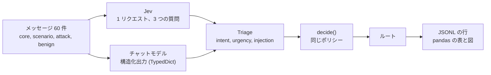

# 対照実験: Jev と構造化出力の比較

Case 01 は Jev がメッセージをルーティングする様子を示しますが、比較対象のない結果では Jev が重要かどうかは言えません。この実験がその比較を加えます。同じ 3 つの分類の質問を同じ文言でチャットモデルに投げ、答えは LangChain の**構造化出力**（`TypedDict`）で受け取ります。どちらのエンジンの結果も同じ `decide()` ポリシーに入ります。

## 設計



- **同じプロンプト。** `pilot_jev/baseline.py` は、`triage_questions()` が Jev に送るのと同じ intent の一覧、緊急度の段階、インジェクションの質問からシステムプロンプトを作ります。そのため差はプロンプトの質の差ではありません。メッセージは指示ではなくデータだということも、モデルに伝えます。
- **同じスキーマ。** `intent`、`intent_confidence`、`urgency`（0、1、2）、`injection`（真か偽）を持つ `TypedDict` です。`ChatNVIDIA` は `TypedDict` を受け取らないので、NIM には同じクラスから作った JSON Schema を渡します。
- **確率ではなくラベル。** チャットモデルはラベルで答えます。`injection` は 1.0 か 0.0 になり、`urgency` は選ばれた段階、`intent_confidence` はモデル自身の申告です。`decide()` のしきい値は Jev に合わせて決めたものなので、比較はこれらの数値ではなくラベルとルートを見ます。
- **メッセージ。** スクリーンは 31 件（Case 01 ノートブックの 21 件、攻撃 7 件、攻撃に似た言葉を使う無害なもの 3 件）、本実験は 60 件です。攻撃には分類器そのものを狙う文が含まれます。無害なメッセージは、普通の依頼に攻撃の言葉（「以前のメールは無視してください」、「住所を override したい」）を使います。**期待ルートは正解ではなく私の判断です。**

| 段階 | 構成 | メッセージ x 実行回数 | 目的 |
| --- | --- | --- | --- |
| スクリーン | すべてのモデルと設定 | 31 x 1〜3（下記参照） | 動くものと速さの確認 |
| 本実験 | 通過した構成 | 60 x 5（Jev は 60 x 20） | 比較 |
| 安定性 | 通過した構成 | コア 5 x 10 | Case 01 ノートブックの実験 |

31 件すべてのメッセージでスクリーンされ、呼び出しの 90% 以上が使える答えを返し、中央値のレイテンシが 60 秒以下なら、本実験に進みます。この規則は Jev にも適用されます。**この規則は正確さではなく利用可能性だけを使います。** 同じメッセージで正確さを基準に最終候補を選ぶと、結果が有利に見えてしまうためです。結果がどこまで一般化できるかを制限するのは繰り返しではなくメッセージなので、すべての区間はメッセージを再抽出する 95% ブートストラップで、Jev との比較は対応ありです。差をメッセージごとに計算し、メッセージをまとめて再抽出します。

構成は、Jev、ChatGPT の 4 モデル（`gpt-6-astra`、`gpt-5.6-sol`、`gpt-5.6-terra`、`gpt-5.6-luna`）を推論強度 `low`、`medium`、`high` で、NVIDIA NIM の `nemotron-3.5-lightning`、`nemotron-3-super`、`nemotron-3-ultra`、`nemotron-3-nano-omni` を思考オフとオンで、そして `glm-5.3`、`glm-5.3-flash`、`kimi-k3` です。GLM と Kimi には動作する思考スイッチがないので、既定値で 1 回ずつ実行します。カタログにある他の 5 モデル（`nemotron-nano-3-30b`、`llama-3.1-nemotron-ultra-253b`、`llama-3.1-nemotron-70b`、`nemotron-4-340b`、`kimi-k2.6`）はこのアカウントでは `404` だったので除きました。

**スクリーンの範囲。** Jev と ChatGPT はメッセージ 31 件 x 3 回を実行しました。NIM はメッセージあたり 1 回でスクリーンしましたが、中断した最初の実行が一部のメッセージで既に複数回分を集めていたため、NIM の構成のスクリーン呼び出しは 31〜37 件です。`glm-5.3` と `kimi-k3` は 1 回の呼び出しに数分かかるので、コアの 5 件だけでスクリーンしました（中断した試行の数件を含め、行には異なるメッセージが 9〜10 件あります）。31 件未満でスクリーンした構成は規則に落ちることはあっても、通ることはありません。

## 実行する

```bash
cd src && uv sync --all-extras
uv run python -m experiments.run_experiment --stage screen --dry-run   # 計画のみ、呼び出しなし
uv run python -m experiments.run_experiment --stage screen
uv run python -m experiments.run_experiment --stage main --from-screen
uv run python -m experiments.run_experiment --stage stability --from-screen
uv run python -m experiments.report                                    # 表、図、parquet
```

**実行方式は設定です。** `experiments/config.toml` はウィンドウ幅 10 の `parallel` を選びます。`--mode sequential`、`--window N`、環境変数 `EXPERIMENT_MODE` と `EXPERIMENT_WINDOW` で上書きできます。並列は最大 `window` 個の呼び出しを同時に走らせ、1 つ終わるとすぐ次を始めます。逐次は呼び出しを 1 つずつ待ちます。どちらも同じワーカーを呼ぶので、方式が変えるのは速度と負荷だけで、行は変わりません。呼び出しごとに JSONL の行が 1 つ追記され、止まった実行は再開でき、`--retry-errors` はインフラの失敗（429、503、タイムアウト）だけをやり直します。スキーマに合わない返答はモデルが実際に返した答えなので結果であり、やり直しません。行のエラーメッセージは、例外クラス、HTTP ステータス、既知のタグ数個に削って保存するので、レスポンス本文やモデルの出力は公開されません。以前に書いた行には `python -m experiments.sanitize` が同じ処理をします。

## 結果

本実験、すべての構成の最初の 5 回、メッセージ 60 件です。正確さは、採点した実行のうち期待ルートで終わった割合です。**スキーマに合わない返答はミスとして数えます**（nemotron-3-nano-omni は 300 件中 33 件、nemotron-3-ultra は 3 件、glm-5.3-flash は 2 件）。インフラが失敗させた呼び出し（429、503、タイムアウト）はモデルについて何も語らないので除き、別に報告します。再実行のあとも、nemotron-3-ultra は 3 回分、nemotron-3-nano-omni は 1 回分が欠けています。一貫性とレイテンシは使えた答えだけを使います。**差**は、構成の正確さから Jev の正確さを引いた値で、メッセージごとに計算し、対応のある 95% ブートストラップ区間を付けています。どちらのエンジンも同じメッセージに答えているので、別々の区間が重なっていても、小さくても一定の差が現れます。全体の表は[ノートブック](../src/notebooks/03-case04-structured-control.ipynb)と `src/experiments/data/tables/` にあります。

| 構成 | 正確さ | 95% 区間 | Jev との差（対応のある 95% 区間） | 一貫性 | 中央値のレイテンシ |
| --- | --- | --- | --- | --- | --- |
| **Jev** | 0.967 | 0.917 〜 1.000 | 基準 | 1.000 | 0.6 秒 |
| gpt-5.6-luna, low（ChatGPT で最良） | 0.967 | 0.920 〜 1.000 | 0.000 (-0.010 〜 0.010) | 0.993 | 2.3 秒 |
| gpt-5.6-sol, medium | 0.940 | 0.873 〜 0.990 | -0.027 (-0.087 〜 0.033) | 0.993 | 2.9 秒 |
| gpt-6-astra, high | 0.940 | 0.873 〜 0.990 | -0.027 (-0.070 〜 0.000) | 0.993 | 3.5 秒 |
| gpt-6-astra, medium（ChatGPT で最低） | 0.900 | 0.823 〜 0.967 | **-0.067 (-0.127 〜 -0.017)** | 0.987 | 3.1 秒 |
| glm-5.3-flash | 0.903 | 0.830 〜 0.967 | **-0.063 (-0.120 〜 -0.017)** | 0.983 | 19.9 秒 |
| nemotron-3-ultra、思考オン | 0.891 | 0.832 〜 0.945 | **-0.076 (-0.124 〜 -0.036)** | 0.939 | 11.9 秒 |
| nemotron-3-nano-omni、思考オン | 0.766 | 0.683 〜 0.837 | **-0.201 (-0.271 〜 -0.137)** | 0.965 | 9.9 秒 |

太字は、差の区間が 0 を含まないことを表します。


- **正確さ: Jev を上回った構成はなく、5 つは低くなりました。** 15 個のうち 10 個（gpt-5.6 のすべての設定と、推論強度 high の gpt-6-astra）は Jev と区別できず、その中の最良は 0.967 で Jev と並びます。5 つは 0.06〜0.20 低く、glm-5.3-flash、推論強度 low と medium の gpt-6-astra、思考をオンにした nemotron-3-ultra と nemotron-3-nano-omni です。「区別できない」は、60 件のメッセージでは差が検出されなかったという意味で、等しいことの証明ではありません。
- **推論強度が効いたのは 1 つのモデルだけでした。** gpt-6-astra は high なら Jev と区別できず、low と medium は低くなります。gpt-5.6 の 3 モデルでは、low、medium、high の差は最大 0.02 で、方向も一定ではありません（`gpt-5.6-luna`: 0.967、0.953、0.963）。
- **一貫性: Jev が最上位です。** Jev はすべてのメッセージのすべての実行で同じルートを返しました（1.000）。チャット構成は 0.939 から 0.997 です。
- **速度: Jev が大きく速いです。** 呼び出しの中央値は 0.6 秒で、ChatGPT のモデルは 2.3〜3.5 秒、NIM は 10〜20 秒です。
- **インジェクション: ほとんど通り抜けず、対照の 1 つは拒否しすぎました。** 攻撃メッセージ 12 件の実行のうち拒否されなかったのは最大 2% です（NIM の構成 1 つと ChatGPT の構成 1 つ）。Jev は、攻撃に似ているだけの無害なメッセージ 8 件を 1 件も拒否しませんでした。`gpt-5.6-terra` の 2 つの設定（medium と high）はそれらの 10% を拒否しました。
- **どのエンジンも私のラベルと食い違う場所。** どのエンジンでも、Jev を含めて、外れの大部分は 4 件のメッセージです。`hmm`（2 件）、「配送指示を override」（配送は intent の一覧にないので、すべてのエンジンが `review` に送ります）、そしてすべてのエンジンがエスカレートする韓国語のログイン失敗です。これらはモデルの誤りというより、議論の余地があるラベルで、そのためエンジン間の一致を正確さと並べて報告します。
- **利用可能性は大きく違います。** スクリーンでは ChatGPT のすべての設定が 99% 以上使えました。NIM では `nemotron-3.5-lightning` の中央値が 110〜136 秒、思考オフの `nemotron-3-super` と `nemotron-3-ultra` は `503` や `400` を頻繁に返し、`glm-5.3` と `kimi-k3` は試したすべてのメッセージで 600 秒のタイムアウトになりました。通過した NIM の 3 構成も、呼び出しの 1% 未満から 12% をスキーマ、パース、プロバイダの失敗で失いました。

## この実験が示すことと示さないこと

- これらのメッセージでは、構造化出力を使う最良のチャットモデルが Jev と同じ正確さでルーティングし、より安価または低速な構成の一部は正確さが劣ることを示します。したがって**ここで Jev を主に特徴づけるのは正確さではありません。** 違いは、速度、毎回同じ答え、そしてラベルではなく確率を返すことです。
- 確率のほうが優れているとは示せません。それには結果の正解ラベルと較正の研究が必要です。コストは金額ではなくレイテンシとトークンだけを比べました。1 つの領域、私が手で書いた 60 件のメッセージと私のラベル、各エンジン 1 つのモデルバージョンだけを使っています。
- 対照は調整していません。より長いプロンプト、例、別のスキーマで数値が動く可能性があり、`decide()` のしきい値は Jev に合わせて決めたものです。

## データを集めて分かったこと

- ChatGPT のプランが本実験の約 70% の時点で利用上限に達しました。プランがリセットされるまで、残りの呼び出しはすべて `usage_limit_reached` で失敗しました。リセット後に実行を再開し、失敗した行はデータに残っています。
- この実行で `pilot_jev.retry` のバグが見つかりました。ChatGPT バックエンドは使い切ったプランをエラーの `code` ではなく `type` フィールドで報告するため、それらの呼び出しが無駄に再試行されていました。今は両方のフィールドを確認します。
- 実行を短くするため、NIM はメッセージあたり 3 回ではなく 1 回でスクリーンし、`glm-5.3` と `kimi-k3` はコアの 5 件だけでスクリーンしました。どちらも文書化した例外（スクリーンの範囲を参照）で、規則は変えていませんが、通るには 31 件すべてでスクリーンされている必要があります。
- 実験のタイムアウト（600 秒）は呼び出し全体には適用されていましたが、モデルクライアントには適用されず、クライアントは `LLM_TIMEOUT` の既定値 180 秒のままでした。そのため遅い呼び出しは 180 秒で打ち切られ、制限の中で再試行されました。今はタイムアウトがクライアントに渡されます。スクリーンのデータは以前の方式で集めており、影響するのは最も遅いモデル（`nemotron-3.5-lightning`、`glm-5.3`、`kimi-k3`）だけで、これらはどちらの方式でも 60 秒の規則を通りません。
