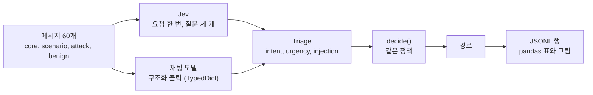

# 대조 실험: Jev와 구조화 출력 비교

Case 01은 Jev가 메시지를 라우팅하는 모습을 보여 주지만, 비교 대상이 없는 결과로는 Jev가 중요한지 말할 수 없습니다. 이 실험이 그 비교를 더합니다. 같은 세 가지 분류 질문을 같은 문구로 채팅 모델에게 묻고, 답은 LangChain **구조화 출력**(`TypedDict`)으로 받습니다. 두 엔진의 결과는 같은 `decide()` 정책에 들어갑니다.

## 설계



- **같은 프롬프트.** `pilot_jev/baseline.py`는 `triage_questions()`가 Jev에게 보내는 것과 같은 intent 목록, 긴급도 단계, 인젝션 질문으로 시스템 프롬프트를 만듭니다. 그래서 차이가 프롬프트 품질의 차이가 아닙니다. 메시지는 지시가 아니라 데이터라는 말도 모델에게 함께 전합니다.
- **같은 스키마.** `intent`, `intent_confidence`, `urgency`(0, 1, 2), `injection`(참/거짓)을 가진 `TypedDict`입니다. `ChatNVIDIA`는 `TypedDict`를 받지 않아서, NIM에는 같은 클래스에서 만든 JSON Schema를 줍니다.
- **확률이 아니라 라벨.** 채팅 모델은 라벨로 답합니다. `injection`은 1.0 또는 0.0이 되고, `urgency`는 고른 단계, `intent_confidence`는 모델 스스로 보고한 값입니다. `decide()`의 임계값은 Jev에 맞춰 정한 것이므로, 비교는 이 숫자가 아니라 라벨과 경로를 봅니다.
- **메시지.** 스크린은 31개(Case 01 노트북의 21개, 공격 7개, 정상이지만 공격과 비슷한 메시지 3개)이고 본 실험은 60개입니다. 공격에는 분류기 자체를 겨냥한 문장이 들어 있습니다. 정상 메시지는 평범한 요청에 공격 단어("이전 메일은 무시해 주세요", "주소를 override")를 씁니다. **기대 경로는 정답이 아니라 제 판단입니다.**

| 단계 | 구성 | 메시지 x 실행 | 목적 |
| --- | --- | --- | --- |
| 스크린 | 모든 모델과 설정 | 31 x 3 (NIM은 31 x 1) | 어떤 구성이 동작하고 얼마나 빠른지 |
| 본 실험 | 통과한 구성 | 60 x 5 (Jev는 60 x 20) | 비교 |
| 안정성 | 통과한 구성 | 핵심 5 x 10 | Case 01 노트북의 실험 |

호출의 90% 이상이 쓸 만한 답을 돌려주고 중앙 지연이 60초 이하이면 본 실험으로 넘어갑니다. **이 규칙은 정확도가 아니라 가용성만 씁니다.** 같은 메시지에서 정확도로 최종 후보를 고르면 결과가 부풀려지기 때문입니다. 결과가 얼마나 일반화되는지를 제한하는 것은 반복이 아니라 메시지이므로, 모든 구간은 메시지를 다시 뽑는 95% 부트스트랩입니다.

구성: Jev, ChatGPT 모델 네 개(`gpt-6-astra`, `gpt-5.6-sol`, `gpt-5.6-terra`, `gpt-5.6-luna`)를 각각 추론 강도 `low`, `medium`, `high`로, NVIDIA NIM의 `nemotron-3.5-lightning`, `nemotron-3-super`, `nemotron-3-ultra`, `nemotron-3-nano-omni`를 추론 끔과 켬으로, 그리고 `glm-5.3`, `glm-5.3-flash`, `kimi-k3`입니다. GLM과 Kimi는 동작하는 추론 스위치가 없어서 기본값으로 한 번씩 돌립니다. 카탈로그에 있는 다른 모델 다섯 개(`nemotron-nano-3-30b`, `llama-3.1-nemotron-ultra-253b`, `llama-3.1-nemotron-70b`, `nemotron-4-340b`, `kimi-k2.6`)는 이 계정에서 `404`라서 뺐습니다.

## 실행하기

```bash
cd src && uv sync --all-extras
uv run python -m experiments.run_experiment --stage screen --dry-run   # 계획만, 호출 없음
uv run python -m experiments.run_experiment --stage screen
uv run python -m experiments.run_experiment --stage main --from-screen
uv run python -m experiments.run_experiment --stage stability --from-screen
uv run python -m experiments.report                                    # 표, 그림, parquet
```

**실행 방식은 설정입니다.** `experiments/config.toml`은 창 크기 10의 `parallel`을 고르고, `--mode sequential`, `--window N`, 환경변수 `EXPERIMENT_MODE`, `EXPERIMENT_WINDOW`로 바꿀 수 있습니다. 병렬은 최대 `window`개의 호출을 동시에 두고, 하나가 끝나면 바로 다음을 시작합니다. 순차는 호출을 하나씩 기다립니다. 둘 다 같은 작업 함수를 부르므로 방식은 속도와 부하만 바꾸고 행은 바꾸지 않습니다. 호출마다 JSONL 행이 하나 추가되고, 중단된 실행은 이어서 하며, `--retry-errors`는 인프라 실패(429, 503, 타임아웃)만 다시 합니다. 스키마에 맞지 않은 답은 모델이 실제로 한 답이므로 결과이고 다시 하지 않습니다.

## 결과

본 실험, 모든 구성의 처음 5회, 메시지 60개입니다. 정확도는 기대 경로로 끝난 실행의 비율입니다. 전체 표는 [노트북](../src/notebooks/03-case04-structured-control-ko.ipynb)과 `src/experiments/data/tables/`에 있습니다.

| 구성 | 정확도 | 95% 구간 | 일관성 | 중앙 지연 |
| --- | --- | --- | --- | --- |
| **Jev** | 0.967 | 0.917 ~ 1.000 | 1.000 | 0.6초 |
| gpt-5.6-luna, low (ChatGPT 중 최고) | 0.967 | 0.920 ~ 1.000 | 0.993 | 2.3초 |
| gpt-5.6-sol, medium | 0.940 | 0.873 ~ 0.990 | 0.993 | 2.9초 |
| gpt-6-astra, medium (ChatGPT 중 최저) | 0.900 | 0.823 ~ 0.967 | 0.987 | 3.1초 |
| glm-5.3-flash | 0.907 | 0.837 ~ 0.970 | 0.983 | 19.9초 |
| nemotron-3-ultra, 추론 켬 | 0.899 | 0.840 ~ 0.952 | 0.939 | 11.9초 |
| nemotron-3-nano-omni, 추론 켬 | 0.858 | 0.775 ~ 0.930 | 0.965 | 9.9초 |


- **정확도: 차이를 찾지 못했습니다.** Jev보다 분명히 낫거나 못한 구성은 없고, 열다섯 개 모두의 구간이 Jev의 구간과 겹칩니다. ChatGPT 중 가장 좋은 구성은 0.967로 Jev와 같습니다. 구간이 겹친다고 같다는 증거는 아닙니다. 메시지가 60개면 구간 폭이 약 0.1입니다.
- **추론 강도는 일관되게 도움이 되지 않았습니다.** 한 ChatGPT 모델 안에서 low, medium, high의 차이는 최대 0.04이고 방향도 하나가 아닙니다(`gpt-5.6-luna`: 0.967, 0.953, 0.963).
- **일관성: Jev가 가장 높습니다.** Jev는 모든 메시지의 모든 실행에서 같은 경로를 냈습니다(1.000). 채팅 구성은 0.939에서 0.997 사이입니다.
- **속도: Jev가 큰 차이로 빠릅니다.** 중앙 호출 시간은 0.6초이고, ChatGPT 모델은 2.3~3.5초, NIM은 10~20초입니다.
- **인젝션: 통과한 것은 없고, 대조군 하나는 지나치게 거절했습니다.** 공격 메시지 12개의 실행 중 거절되지 않은 것은 최대 2%입니다(NIM 구성 하나와 ChatGPT 구성 하나). Jev는 정상이지만 비슷해 보이는 메시지 8개를 하나도 거절하지 않았습니다. `gpt-5.6-terra`의 두 설정(medium과 high)은 그 메시지의 10%를 거절했습니다.
- **모든 엔진이 제 라벨과 다른 곳.** 모든 엔진에서, Jev도 포함해서, 틀린 것의 대부분은 메시지 네 개입니다. `hmm`(두 번), "배송 지시를 override"(배송은 intent 목록에 없어서 모든 엔진이 `review`로 보냄), 그리고 모든 엔진이 escalate하는 한국어 로그인 실패 메시지입니다. 이것들은 모델의 오류라기보다 논란의 여지가 있는 라벨이고, 그래서 엔진 사이의 일치도를 정확도와 함께 보고합니다.
- **가용성은 크게 다릅니다.** 스크린에서 ChatGPT의 모든 설정은 99% 이상 쓸 수 있었습니다. NIM에서는 `nemotron-3.5-lightning`의 중앙 지연이 110~136초였고, 추론을 끈 `nemotron-3-super`와 `nemotron-3-ultra`는 `503`이나 `400`을 자주 돌려주었으며, `glm-5.3`과 `kimi-k3`는 핵심 메시지 다섯 개 모두에서 600초 타임아웃이 났습니다. 통과한 NIM 구성 세 개도 호출의 1% 미만에서 12%를 스키마, 파싱, 공급자 실패로 잃었습니다.

## 이 실험이 보여 주는 것과 보여 주지 않는 것

- 이 메시지들에서는 구조화 출력을 쓰는 채팅 모델이 Jev만큼 정확하게 라우팅한다는 것을 보여 줍니다. 그래서 **여기서 Jev를 구별 짓는 것은 정확도가 아닙니다.** 다른 점은 속도, 매번 같은 답, 그리고 라벨이 아니라 확률을 돌려준다는 것입니다.
- 확률이 더 낫다는 것은 보여 주지 못합니다. 그것은 정답이 붙은 결과와 보정 연구가 필요합니다. 비용은 금액이 아니라 지연과 토큰만 비교했습니다. 한 분야, 제가 손으로 쓴 60개 메시지와 제 라벨, 엔진별 모델 버전 하나만 썼습니다.
- 대조군은 튜닝하지 않았습니다. 더 긴 프롬프트, 예시, 다른 스키마로 수치가 움직일 수 있고, `decide()`의 임계값은 Jev에 맞춰 정했습니다.

## 데이터를 모으며 알게 된 것

- ChatGPT 요금제가 본 실험의 약 70% 지점에서 사용량 한도에 도달했습니다. 요금제가 초기화될 때까지 남은 호출은 모두 `usage_limit_reached`로 실패했습니다. 초기화 뒤 실행을 이어 갔고, 실패한 행은 데이터에 남아 있습니다.
- 이 실행에서 `pilot_jev.retry`의 버그가 드러났습니다. ChatGPT 백엔드는 소진된 요금제를 오류의 `code`가 아니라 `type` 필드에 담아 보내서, 그 호출들이 헛되이 재시도되고 있었습니다. 이제 두 필드를 모두 확인합니다.
- 실행 시간을 줄이려고 NIM은 메시지당 3회 대신 1회로 스크린했고, `glm-5.3`과 `kimi-k3`는 핵심 메시지 다섯 개로만 스크린했습니다. 둘 다 문서화된 예외이며 규칙은 바뀌지 않았습니다.
