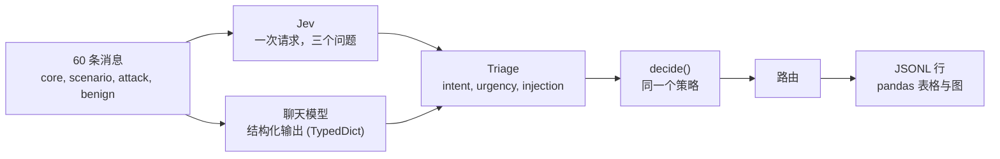

# 对照实验：Jev 与结构化输出

Case 01 展示了 Jev 对消息进行路由，但没有可比较对象的结果，无法说明 Jev 是否重要。这个实验补上了比较。同样的三个分类问题，用同样的措辞交给聊天模型，答案必须通过 LangChain 的**结构化输出**（`TypedDict`）给出。两个引擎的结果都进入同一个 `decide()` 策略。

## 设计



- **同样的提示词。** `pilot_jev/baseline.py` 用 `triage_questions()` 发给 Jev 的同一份 intent 列表、紧急程度等级和注入问题来构建系统提示词，所以差异不是提示词质量的差异。它还告诉模型：消息是数据，不是指令。
- **同样的模式。** 一个带有 `intent`、`intent_confidence`、`urgency`（0、1、2）和 `injection`（真或假）的 `TypedDict`。`ChatNVIDIA` 不接受 `TypedDict`，所以 NIM 得到的是由同一个类派生出的 JSON Schema。
- **标签，而不是概率。** 聊天模型用标签作答。`injection` 变成 1.0 或 0.0，`urgency` 是选中的等级，`intent_confidence` 是模型自己报告的值。`decide()` 的阈值是按 Jev 选定的，所以比较看的是标签和路由，而不是这些数字。
- **消息。** 筛选阶段 31 条（Case 01 notebook 的 21 条、7 条攻击、3 条看似攻击的正常消息），主实验 60 条。攻击里包含针对分类器本身的文字。正常消息在普通请求里使用攻击性词语（“请忽略我之前的邮件”“我想 override 地址”）。**预期路由是我的判断，不是真值。**

| 阶段 | 配置 | 消息 x 运行次数 | 目的 |
| --- | --- | --- | --- |
| 筛选 | 所有模型和设置 | 31 x 1 至 3（见下） | 哪些能用，速度如何 |
| 主实验 | 通过筛选的配置 | 60 x 5（Jev 为 60 x 20） | 比较 |
| 稳定性 | 通过筛选的配置 | 核心 5 x 10 | Case 01 notebook 的实验 |

当一个配置在全部 31 条消息上都做过筛选，至少 90% 的调用返回了可用答案，并且中位延迟不超过 60 秒时，进入主实验。这条规则也适用于 Jev。**这条规则只看可用性，从不看准确率**，因为在同一批消息上按准确率挑选入围者会让结果显得更好。限制结果能推广到多大范围的是消息而不是重复次数，所以所有区间都是对消息重采样的 95% bootstrap，与 Jev 的比较是配对的：差值按消息逐条计算，消息一起重采样。

配置：Jev；ChatGPT 的四个模型 `gpt-6-astra`、`gpt-5.6-sol`、`gpt-5.6-terra`、`gpt-5.6-luna`，各用 `low`、`medium`、`high` 推理强度；NVIDIA NIM 的 `nemotron-3.5-lightning`、`nemotron-3-super`、`nemotron-3-ultra`、`nemotron-3-nano-omni`，分别关闭和开启思考；以及 `glm-5.3`、`glm-5.3-flash`、`kimi-k3`。GLM 和 Kimi 没有可用的思考开关，所以各用默认设置运行一次。目录里另外五个模型（`nemotron-nano-3-30b`、`llama-3.1-nemotron-ultra-253b`、`llama-3.1-nemotron-70b`、`nemotron-4-340b`、`kimi-k2.6`）在这个账号上返回 `404`，所以没有纳入。

**筛选范围。** Jev 和 ChatGPT 运行了 31 条消息 x 3 次。NIM 每条消息筛选了 1 次，但被中断的第一次运行已经为部分消息收集了多次结果，所以 NIM 配置有 31 到 37 次筛选调用。`glm-5.3` 和 `kimi-k3` 每次调用要几分钟，所以只在五条核心消息上筛选（算上被中断那次尝试的几条，行中共有 9 到 10 条不同的消息）。在少于 31 条消息上筛选的配置可能被规则淘汰，但不可能通过规则。

## 运行

```bash
cd src && uv sync --all-extras
uv run python -m experiments.run_experiment --stage screen --dry-run   # 只看计划，不调用
uv run python -m experiments.run_experiment --stage screen
uv run python -m experiments.run_experiment --stage main --from-screen
uv run python -m experiments.run_experiment --stage stability --from-screen
uv run python -m experiments.report                                    # 表格、图、parquet
```

**运行方式是一项设置。** `experiments/config.toml` 选择窗口为 10 的 `parallel`，可用 `--mode sequential`、`--window N` 或环境变量 `EXPERIMENT_MODE`、`EXPERIMENT_WINDOW` 覆盖。并行方式最多同时保持 `window` 个调用，一个结束就立即开始下一个。顺序方式逐个等待调用。两者对同一份任务列表调用同一个工作函数。运行方式会改变发送调用的时间，可能影响延迟和可用性，所以每一行都记录了 `mode` 和 `window`（这份数据中的所有行都是以窗口为 10 的并行方式收集的）。每次调用追加一行 JSONL，中断的运行可以续跑，`--retry-errors` 只重做基础设施类失败（429、503、超时）。不符合模式的回复是模型实际给出的答案，因此属于结果，不会重试。行中的错误信息会被精简为异常类、HTTP 状态和少数已知标签，因此不会公开响应正文或模型输出；`python -m experiments.sanitize` 会对旧的行做同样的处理。

## 结果

主实验，每个配置的前 5 次运行，60 条消息。准确率是已评分的运行中落在预期路由上的比例。**不符合模式的回复算作答错**（nemotron-3-nano-omni 300 次中有 33 次，nemotron-3-ultra 有 1 次，glm-5.3-flash 有 2 次）。基础设施导致失败的调用（429、503、超时）不说明模型的任何情况，所以被排除并单独报告：重跑之后，nemotron-3-ultra 仍缺 3 次运行，nemotron-3-nano-omni 缺 1 次。一致性和延迟只使用可用的答案。**差值**是配置的准确率减去 Jev 的准确率，按消息逐条计算，并给出配对的 95% bootstrap 区间：两个引擎回答的是同一批消息，所以即使各自的区间重叠，一个小而稳定的差距也能显现出来。完整表格在 [notebook](../src/notebooks/03-case04-structured-control.ipynb) 和 `src/experiments/data/tables/` 中。

| 配置 | 准确率 | 95% 区间 | 与 Jev 的差值（配对 95% 区间） | 一致性 | 中位延迟 |
| --- | --- | --- | --- | --- | --- |
| **Jev** | 0.967 | 0.917 至 1.000 | 基准 | 1.000 | 0.6 秒 |
| gpt-5.6-luna，low（ChatGPT 中最好） | 0.967 | 0.920 至 1.000 | 0.000 (-0.010 至 0.010) | 0.993 | 2.3 秒 |
| gpt-5.6-sol，medium | 0.940 | 0.873 至 0.990 | -0.027 (-0.087 至 0.033) | 0.993 | 2.9 秒 |
| gpt-6-astra，high | 0.940 | 0.873 至 0.990 | -0.027 (-0.070 至 0.000) | 0.993 | 3.5 秒 |
| gpt-6-astra，medium（ChatGPT 中最低） | 0.900 | 0.823 至 0.967 | **-0.067 (-0.127 至 -0.017)** | 0.987 | 3.1 秒 |
| glm-5.3-flash | 0.903 | 0.830 至 0.967 | **-0.063 (-0.120 至 -0.017)** | 0.983 | 19.9 秒 |
| nemotron-3-ultra，开启思考 | 0.896 | 0.837 至 0.949 | **-0.071 (-0.118 至 -0.031)** | 0.939 | 11.9 秒 |
| nemotron-3-nano-omni，开启思考 | 0.766 | 0.683 至 0.837 | **-0.201 (-0.271 至 -0.137)** | 0.965 | 9.9 秒 |

粗体表示差值的区间不包含 0。


- **准确率：没有配置胜过 Jev，有五个更低。** 十五个配置中有十个（gpt-5.6 的所有设置，以及推理强度为 high 的 gpt-6-astra）与 Jev 无法区分，其中最好的以 0.967 与 Jev 持平。有五个低 0.06 到 0.20：glm-5.3-flash、推理强度为 low 和 medium 的 gpt-6-astra，以及开启思考的 nemotron-3-ultra 和 nemotron-3-nano-omni。“无法区分”是指 60 条消息下没有检测到差异，并不证明相等。
- **推理强度只对一个模型有影响。** gpt-6-astra 在 high 时与 Jev 无法区分，low 和 medium 则更低。对三个 gpt-5.6 模型，low、medium、high 的差别最多为 0.02，而且方向不一致（`gpt-5.6-luna`：0.967、0.953、0.963）。
- **一致性：Jev 居首。** Jev 在每条消息的每次运行中都给出了相同的路由（1.000）。聊天配置在 0.939 到 0.997 之间。
- **速度：Jev 快得多。** 中位调用耗时 0.6 秒，ChatGPT 模型为 2.3 到 3.5 秒，NIM 为 10 到 20 秒。
- **注入：几乎没有漏过的，其中一个对照拒绝得过多。** 12 条攻击消息的运行中，未被拒绝的最多为 2%（一个 NIM 配置和一个 ChatGPT 配置）。Jev 没有拒绝 8 条看似攻击的正常消息中的任何一条。`gpt-5.6-terra` 的两个设置（medium 和 high）拒绝了其中的 10%。
- **所有引擎都与我的标签不一致的地方。** 在每个引擎中，包括 Jev，大部分错误集中在四条消息：`hmm`（两次）、“override 配送说明”（配送不在 intent 列表里，所有引擎都把它送往 `review`），以及所有引擎都升级处理的一条韩语登录失败消息。这些与其说是模型错误，不如说是有争议的标签，这也是为什么要在报告准确率的同时报告引擎之间的一致程度。
- **可用性差别很大。** 在筛选中，ChatGPT 的所有设置可用率都在 99% 以上。在 NIM 上，`nemotron-3.5-lightning` 的中位延迟为 110 到 136 秒，关闭思考的 `nemotron-3-super` 和 `nemotron-3-ultra` 经常返回 `503` 或 `400`，`glm-5.3` 和 `kimi-k3` 在尝试过的每条消息上都在 600 秒时超时。通过筛选的三个 NIM 配置也因模式、解析或提供方失败损失了不到 1% 到 12% 的调用。

## 这个实验说明什么，不说明什么

- 它说明在这些消息上，使用结构化输出的最好的聊天模型与 Jev 一样准确地路由，而一些更便宜或更慢的配置准确率更低，所以**在这里，让 Jev 与众不同的主要不是准确率。** 不同之处是速度、每次给出相同的答案，以及返回的是概率而不是标签。
- 它不能说明概率更好，那需要带标注的结果和校准研究。它没有比较费用，只比较了延迟和 token。它只用了一个领域、我手写的 60 条消息和我自己的标签，每个引擎只有一个模型版本。
- 对照组没有调优。更长的提示词、示例或不同的模式都可能改变数字，而 `decide()` 的阈值是按 Jev 选定的。

## 收集数据时的发现

- ChatGPT 套餐在主实验大约 70% 处达到了用量上限。在套餐重置之前，剩余的调用都以 `usage_limit_reached` 失败。重置后运行继续，失败的行仍保留在数据中。
- 这次运行暴露了 `pilot_jev.retry` 中的一个缺陷：ChatGPT 后端把用尽的套餐放在错误的 `type` 字段而不是 `code` 中，所以这些调用被白白重试了。现在两个字段都会检查。
- 为缩短运行时间，NIM 每条消息只筛选了 1 次而不是 3 次，`glm-5.3` 和 `kimi-k3` 只在五条核心消息上筛选。这两点都是有文档记录的偏差（见筛选范围），规则没有改变，只是现在必须在全部 31 条消息上筛选过才能通过。
- 实验超时（600 秒）作用于整个调用，但没有传给模型客户端，客户端沿用 `LLM_TIMEOUT` 的默认值 180 秒，所以慢调用会在 180 秒被切断并在限制内重试。现在超时已经传给客户端。筛选数据是按旧方式收集的，只影响最慢的模型（`nemotron-3.5-lightning`、`glm-5.3`、`kimi-k3`），而它们无论哪种方式都通不过 60 秒规则。
