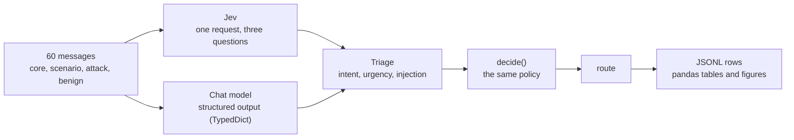

# Control experiment: Jev against structured output

Case 01 shows Jev routing messages, but a result with nothing to compare it to cannot say whether Jev
matters. This experiment adds the comparison. The same three triage questions, worded the same way, go
to chat models that must answer through LangChain **structured output** (a `TypedDict`), and both
engines feed the same `decide()` policy.

## Design



- **Same prompt.** `pilot_jev/baseline.py` builds the system prompt from the same intent list, urgency
  levels, and injection question that `triage_questions()` sends to Jev, so a difference is not a
  difference in prompt quality. It also tells the model that the message is data, not instructions.
- **Same schema.** A `TypedDict` with `intent`, `intent_confidence`, `urgency` (0, 1, 2), and
  `injection` (true or false). `ChatNVIDIA` takes no `TypedDict`, so NIM gets the JSON Schema derived from
  the same class.
- **Labels, not probabilities.** A chat model answers with a label. `injection` becomes 1.0 or 0.0,
  `urgency` is the chosen level, and `intent_confidence` is the model's own report. The thresholds of
  `decide()` were chosen for Jev, so the comparison looks at labels and routes, not at those numbers.
- **Messages.** 31 for the screen (the 21 of the Case 01 notebook, 7 attacks, 3 benign look-alikes) and
  60 for the main stage. Attacks include text aimed at the classifier itself. Benign look-alikes use
  attack words ("ignore my previous email", "override the address") in an ordinary request.
  **The expected route is my judgment, not ground truth.**

| Stage | Configurations | Messages x runs | Purpose |
| --- | --- | --- | --- |
| Screen | every model and setting | 31 x 1 to 3 (see below) | which ones work, and how fast |
| Main | the ones that passed | 60 x 5 (Jev 60 x 20) | the comparison |
| Stability | the ones that passed | 5 core x 10 | the experiment of the Case 01 notebook |

A configuration goes on to the main stage when it was screened on all 31 messages, at least 90% of its
calls returned a usable answer, and its median latency is 60 s or less. The rule applies to Jev too. **The rule uses availability, never accuracy**, because choosing
finalists by accuracy on the same messages would flatter them. Messages, not repeats, limit how far a
result generalizes, so every interval is a 95% bootstrap over messages, and the comparison with Jev is
paired: the difference is taken per message and messages are resampled together.

Configurations: Jev; the four ChatGPT models `gpt-6-astra`, `gpt-5.6-sol`, `gpt-5.6-terra`, and
`gpt-5.6-luna`, each at `low`, `medium`, and `high` reasoning effort; NVIDIA NIM `nemotron-3.5-lightning`,
`nemotron-3-super`, `nemotron-3-ultra`, and `nemotron-3-nano-omni` with thinking off and on, `glm-5.3`,
`glm-5.3-flash`, and `kimi-k3`. GLM and Kimi have no thinking switch that worked, so they run once with
their default. Five more catalog models (`nemotron-nano-3-30b`, `llama-3.1-nemotron-ultra-253b`,
`llama-3.1-nemotron-70b`, `nemotron-4-340b`, `kimi-k2.6`) answer `404` on this account and were left out.

**Screen coverage.** Jev and ChatGPT ran 31 messages x 3 runs. NIM was screened once per message, but a
first run that was stopped had already collected extra runs for some messages, so the NIM
configurations have 31 to 37 screen calls. `glm-5.3` and `kimi-k3` need minutes per call, so they were
screened on the five core messages only (nine or ten distinct messages in the rows, counting a few from
the stopped attempt). A configuration screened on fewer than 31 messages can fail the rule and cannot
pass it.

## Run it

```bash
cd src && uv sync --all-extras
uv run python -m experiments.run_experiment --stage screen --dry-run   # the plan, no calls
uv run python -m experiments.run_experiment --stage screen
uv run python -m experiments.run_experiment --stage main --from-screen
uv run python -m experiments.run_experiment --stage stability --from-screen
uv run python -m experiments.report                                    # tables, figures, parquet
```

The **run mode is a setting**. `experiments/config.toml` chooses `parallel` with a window of 10, and
`--mode sequential`, `--window N`, or the `EXPERIMENT_MODE` and `EXPERIMENT_WINDOW` variables override it.
Parallel keeps up to `window` calls in flight and starts the next as soon as one finishes. Sequential
awaits each call. Both call the same worker, so the mode changes speed and load, not the rows. Every
call appends one JSONL row, a stopped run resumes, and `--retry-errors` redoes only infrastructure
failures (a 429, a 503, a timeout). A reply that failed the schema is what the model answered, so it is
a result and is never retried. Error messages in the rows are reduced to the exception class, the HTTP
status, and a few known tags, so no response body or model output is published;
`python -m experiments.sanitize` does the same for older rows.

## Results

Main stage, first 5 runs of every configuration, 60 messages. Accuracy is the share of runs on the
expected route. **Difference** is the configuration's accuracy minus Jev's, taken message by message,
with a paired 95% bootstrap interval: both engines answered the same messages, so a small steady gap
shows up even when the two separate intervals overlap. The full tables are in the
[notebook](../src/notebooks/03-case04-structured-control.ipynb) and in `src/experiments/data/tables/`.

| Configuration | Accuracy | 95% interval | Difference from Jev (paired 95% interval) | Consistency | Median latency |
| --- | --- | --- | --- | --- | --- |
| **Jev** | 0.967 | 0.917 to 1.000 | reference | 1.000 | 0.6 s |
| gpt-5.6-luna, low (best of ChatGPT) | 0.967 | 0.920 to 1.000 | 0.000 (-0.010 to 0.010) | 0.993 | 2.3 s |
| gpt-5.6-sol, medium | 0.940 | 0.873 to 0.990 | -0.027 (-0.087 to 0.033) | 0.993 | 2.9 s |
| gpt-6-astra, high | 0.940 | 0.873 to 0.990 | -0.027 (-0.070 to 0.000) | 0.993 | 3.5 s |
| gpt-6-astra, medium (lowest of ChatGPT) | 0.900 | 0.823 to 0.967 | **-0.067 (-0.127 to -0.017)** | 0.987 | 3.1 s |
| glm-5.3-flash | 0.907 | 0.837 to 0.970 | **-0.060 (-0.117 to -0.013)** | 0.983 | 19.9 s |
| nemotron-3-ultra, thinking on | 0.899 | 0.840 to 0.952 | **-0.067 (-0.114 to -0.030)** | 0.939 | 11.9 s |
| nemotron-3-nano-omni, thinking on | 0.858 | 0.775 to 0.930 | **-0.108 (-0.180 to -0.046)** | 0.965 | 9.9 s |

Bold means the interval of the difference excludes zero.


- **Accuracy: nothing beat Jev, and five configurations were lower.** Ten of the fifteen (every
  gpt-5.6 setting and gpt-6-astra at high effort) cannot be told apart from Jev, and the best of them ties
  it at 0.967. Five are lower by 0.06 to 0.11: glm-5.3-flash, gpt-6-astra at low and medium effort, and
  nemotron-3-ultra and nemotron-3-nano-omni with thinking on. "Cannot be told apart" means no detected
  difference with 60 messages, not proof of equality.
- **Reasoning effort mattered for one model.** For gpt-6-astra, high effort cannot be told apart from Jev
  while low and medium are lower. For the three gpt-5.6 models, low, medium, and high differ by at most
  0.02 and not in one direction (`gpt-5.6-luna`: 0.967, 0.953, 0.963).
- **Consistency: Jev is at the top.** Jev gave the same route on every run of every message (1.000). The
  chat configurations range from 0.939 to 0.997.
- **Speed: Jev is faster by a wide margin.** The median call takes 0.6 s against 2.3 to 3.5 s for the
  ChatGPT models and 10 to 20 s for NIM.
- **Injection: almost nothing got through, and one control refused too much.** At most 2% of runs on the
  12 attack messages were not refused (one NIM and one ChatGPT configuration). Jev refused none of the 8
  benign look-alikes. Two `gpt-5.6-terra` settings (medium and high) refused 10% of them.
- **Where everyone disagrees with my label.** Four messages account for most misses in every engine,
  Jev included: `hmm` (twice), "override the shipping instructions" (all engines send it to `review`
  because shipping is not one of the intents), and a Korean login failure that all engines escalate. Those
  are debatable labels more than model errors, and they are why agreement between engines is reported
  next to accuracy.
- **Availability differs a lot.** In the screen every ChatGPT setting was usable at 99% or better. On NIM,
  `nemotron-3.5-lightning` had a median of 110 to 136 s, `nemotron-3-super` and `nemotron-3-ultra` with
  thinking off returned `503` or `400` often, and `glm-5.3` and `kimi-k3` timed out at 600 s on every
  message they were tried on. The three NIM configurations that passed still lost between under 1% and 12%
  of calls to schema, parsing, or provider failures.

## What this does and does not show

- It shows that on these messages the best chat models with structured output route as accurately as Jev,
  and that some cheaper or slower configurations are less accurate, so **accuracy is not what mainly sets
  Jev apart here**. What differs is speed, the same answer every time, and that Jev returns a probability
  instead of a label.
- It does not show that the probabilities are better, because that needs labelled outcomes and a
  calibration study. It does not compare money, only latency and tokens. It uses one domain, a
  hand-written 60-message set with my own labels, and one model version of each engine.
- The control gets no tuning. A longer prompt, examples, or a different schema could move its numbers,
  and the thresholds of `decide()` were chosen for Jev.

## Notes from collecting the data

- The ChatGPT plan hit its usage limit at about 70% of the main stage. Every remaining call failed with
  `usage_limit_reached` until the plan reset. The run resumed after the reset and the failed rows stay in
  the data.
- That run exposed a bug in `pilot_jev.retry`: the ChatGPT backend reports a used-up plan in the `type`
  field of the error and not in `code`, so those calls were retried for nothing. Both fields are checked
  now.
- To keep the run short, NIM was screened with one run per message instead of three, and `glm-5.3` and
  `kimi-k3` on the five core messages only. Both are documented deviations (see Screen coverage), and the
  rule did not change, except that a configuration must now be screened on all 31 messages to pass.
